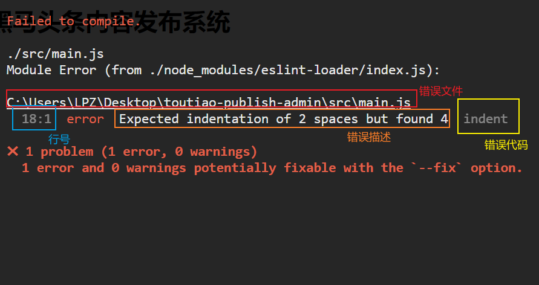
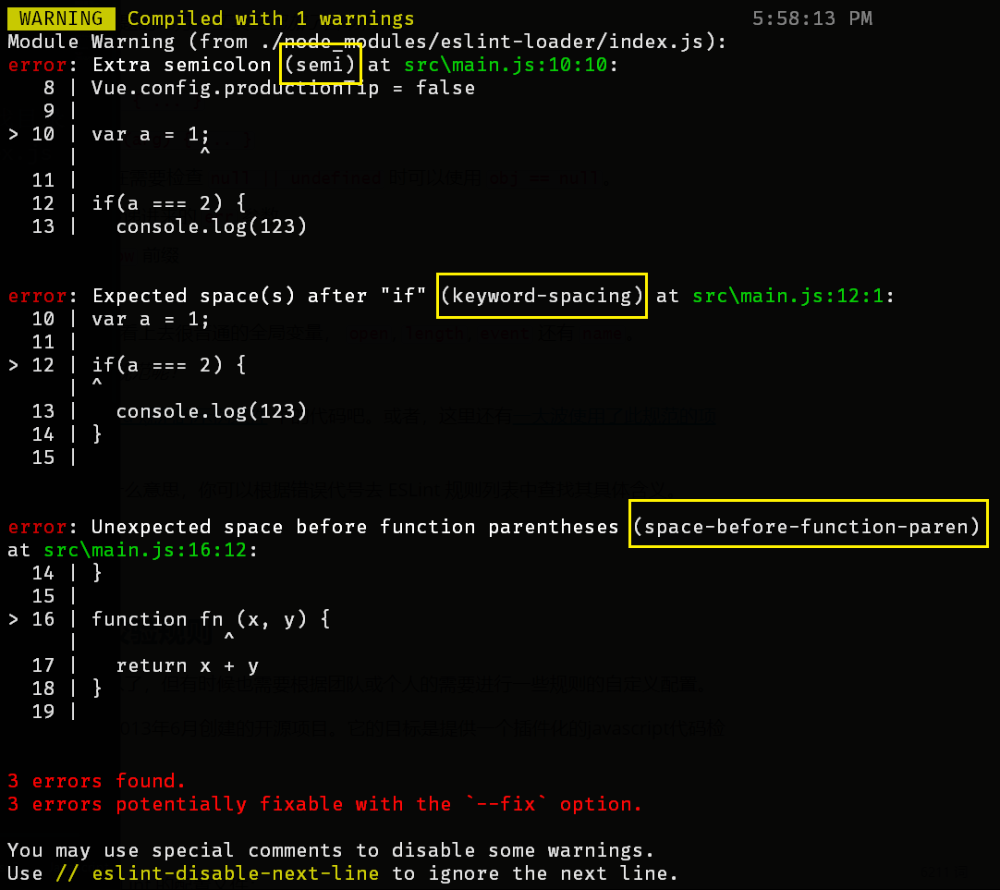
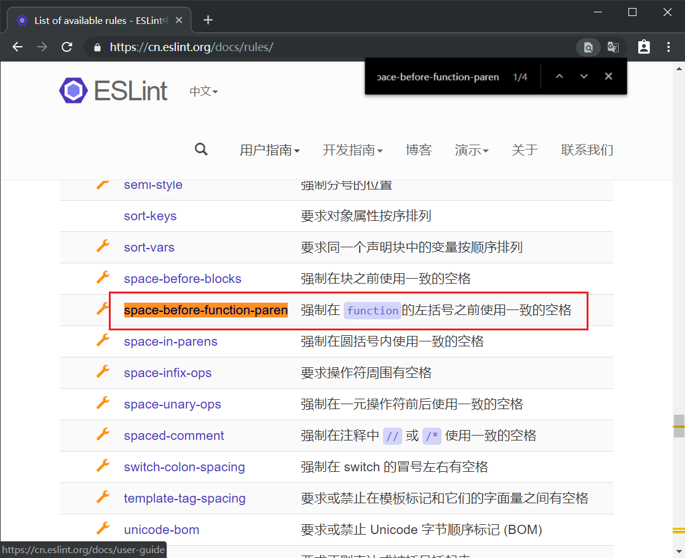

# 一、项目初始化

## 使用 Vue CLI 创建项目

> 注意：不要使用 Git Bash 执行项目创建操作，使用  cmd 或者 powershell 之类的工具。

> 如果你还没有安装 VueCLI，或者版本低于 4，请执行下面的命令安装或是升级：
>
> ```shell
> npm install --global @vue/cli
> ```

在命令行中输入以下命令创建 Vue 项目：
```shell
vue create toutiao-publish-admin
```

```shell
Vue CLI v4.2.3
? Please pick a preset:
  default (babel, eslint)
> Manually select features
```
> default：默认勾选 babel、eslint，回车之后直接进入装包
>
> manually：自定义勾选特性配置，选择完毕之后，才会进入装包
>
> 选择第 2 种：手动选择特性，支持更多自定义选项


```shell
? Please pick a preset: Manually select features
? Check the features needed for your project:
 (*) Babel
 ( ) TypeScript
 ( ) Progressive Web App (PWA) Support
 (*) Router
 ( ) Vuex
 (*) CSS Pre-processors
>(*) Linter / Formatter
 ( ) Unit Testing
 ( ) E2E Testing
```
> 分别选择：
> Babel：es6 转 es5
> Router：路由
> CSS Pre-processors：CSS 预处理器，后面会提示你选择 less、sass、stylus 等
> Linter / Formatter：代码格式校验，ESLint 代码格式校验


```shell
? Use history mode for router? (Requires proper server setup for index fallback in production) (Y/n) n
```
> 是否使用 history 路由模式，这里输入 `n` 不使用


```shell
? Pick a CSS pre-processor (PostCSS, Autoprefixer and CSS Modules are supported by default):
  Sass/SCSS (with dart-sass)
  Sass/SCSS (with node-sass)
> Less
  Stylus
```
> 选择 CSS 预处理器，这里选择我们熟悉的 Less


```shell
? Pick a linter / formatter config:
  ESLint with error prevention only
  ESLint + Airbnb config
> ESLint + Standard config
  ESLint + Prettier
```
> 选择校验工具，这里选择 ESLint + [Standard config](https://standardjs.com/)


```shell
? Pick additional lint features:
 (*) Lint on save
>(*) Lint and fix on commit
```
> 选择在什么时机下触发代码格式校验：
> - Lint on save：每当保存文件的时候
> - Lint and fix on commit：每当执行 `git commit` 提交的时候
>
> 这里建议两个都选上，更严谨。


```shell
? Where do you prefer placing config for Babel, ESLint, etc.? (Use arrow keys)
> In dedicated config files
  In package.json
```
> Babel、ESLint 等工具会有一些额外的配置文件，这里的意思是问你将这些工具相关的配置文件写到哪里：
> - In dedicated config files：分别保存到单独的配置文件
> - In package.json：保存到 package.json 文件中
>
> 这里建议选择第 1 个，保存到单独的配置文件，这样方便我们做自定义配置。


```shell
? Save this as a preset for future projects? (y/N) N
```
> 这里里是问你是否需要将刚才选择的一系列配置保存起来，然后它可以帮你记住上面的一系列选择，以便下次直接重用。

> 这里根据自己需要输入 y 或者 n，我这里输入 n 不需要。


```shell
✨  Creating project in C:\Users\LPZ\Desktop\topline-m-fe89\topline-m-89.
�  Initializing git repository...
⚙  Installing CLI plugins. This might take a while...

[          ........] - extract:object-keys: sill extract json5@2.1.1
```
> 向导配置结束，开始装包。
> 安装包的时间可能较长，请耐心等待......


```shell
⚓  Running completion hooks...

�  Generating README.md...

�  Successfully created project topline-m-89.
�  Get started with the following commands:

 $ cd topline-m
 $ npm run serve
```
安装结束，命令提示你项目创建成功，按照命令行的提示在终端中分别输入：

```shell
# 进入你的项目目录
cd toutiao-webapp

# 启动开发服务
npm run serve
```


```shell
 DONE  Compiled successfully in 7527ms


  App running at:
  - Local:   http://localhost:8080/
  - Network: http://192.168.10.216:8080/

  Note that the development build is not optimized.
  To create a production build, run npm run build.
```
> 启动成功，命令行中输出项目的 http 访问地址。
> 打开浏览器，输入其中任何一个地址进行访问。


如果能看到该页面，恭喜你，项目创建成功了。

## 初始目录结构说明


## 加入 Git 版本管理

建议在项目的一开始就加入版本管理，通过版本管理，我们可以得到很多好处，例如：

- 代码备份
- 多人协作
- 历史记录
- ....

下面是具体的操作流程。

（1）创建远程仓库（GitHub、Gitee、coding）。。。。

（2）把本地仓库推送到远程仓库

如果没有本地仓库：

```shell
# 初始化本地仓库
git init

# 把文件添加到暂存区
git add README.md

# 把暂存区文件提交到本地仓库形成历史记录
git commit -m "first commit"

# 添加远端仓库地址到本地仓库
git remote add origin https://github.com/lipengzhou/toutiao-publish-admin.git

# 推送到远程仓库
git push -u origin master
```


如果已有本地仓库

> VueCLI 在创建项目的时候自动帮你初始化了 `Git` 仓库，并且基于初始代码默认执行了一次提交。

```shell
git remote add origin https://github.com/lipengzhou/toutiao-publish-admin.git

# -u 就是记住本次推送的信息，下次就不用写推送信息了，可以直接 git push
git push -u origin master
```

（3）之后如果有代码变动需要提交

```shell
git add
git commit

# 推送到远程仓库
# 推送的时候如果不改变远程仓库和分支的话就直接
git push

# 如果推送的远程仓库或是分支改变了
$ git push -u 远程仓库 分支名称
```


> 扩展：管理远程仓库地址信息
>
> ```shell
> # 查看使用帮助
> git remote --help
> 
> # 查看所有的远程仓库信息
> git remote -v
> 
> # 添加远程仓库地址信息
> git remote add 名称 远程仓库地址
> 
> # 删除指定的远程仓库信息
> git remote remove 名称
> 
> # 修改远程仓库地址信息
> git remote set-url 远程仓库地址名称 新地址
> ```

## 调整初始目录结构

这里主要就是下面的两个工作：

- 删除初始化的默认文件
- 新增调整我们需要的目录结构

1、将 `App.vue` 修改为：

```html
<template>
  <div id="app">
    <h1>黑马头条内容发布系统</h1>
    <!-- 路由出口 -->
    <router-view/>
  </div>
</template>

<script>
export default {
  name: 'App'
}
</script>

<style lang="less"></style>

```

2、将 `router/index.js` 修改为：

```javascript
import Vue from 'vue'
import VueRouter from 'vue-router'

Vue.use(VueRouter)

// 路由配置表
const routes = []

const router = new VueRouter({
  routes
})

export default router

```

3、删除默认生成的不相关文件：

- src/views/About.vue
- src/views/Home.vue
- src/components/HelloWorld.vue
- src/assets/logo.png


4、增加以下几个目录

- src/api 目录
  - 存储接口模块
- src/utils 目录
  - 存储一些工具模块
- src/styles 目录
  - index.less 文件，设置全局样式
  - 在 `main.js` 中加载全局样式 `import './styles/index.less'`


调整之后的目录结构如下。

```
.                                 
├── README.md                     
├── babel.config.js               
├── package-lock.json             
├── package.json                  
├── public                        
│   ├── favicon.ico               
│   └── index.html                
└── src                           
    ├── api
    ├── App.vue                   
    ├── assets                    
    ├── components                
    ├── main.js                   
    ├── router
    ├── utils
    ├── styles               
    └── views
```

## JavaScript 代码规范

### 什么是编码规范

### 如何统一编码规范

ESLint。

### 流行的编码规范

- Airbnb JavaScript Style
  - 非常严谨，规则特别多

- JavaScript Standard Style
  - 相比 Airbnb JavaScript Style 要宽松一些。

我们项目中使用的是 [JavaScript Standard Style](https://standardjs.com/readme-zhcn.html) 代码风格。下面是它的一些具体规则要求：

### JavaScript Standard Style 规范说明

建议把：https://standardjs.com/rules-zhcn.html 看一遍，然后在写的时候遇到错误就查询解决。

- **使用两个空格** – 进行缩进

- **字符串使用单引号** – 需要转义的地方除外

- **不再有冗余的变量** – 这是导致 _大量_ bug 的源头!

- **无分号** – [这](http://blog.izs.me/post/2353458699/an-open-letter-to-javascript-leaders-regarding)[没什么不好。](http://inimino.org/~inimino/blog/javascript_semicolons)[不骗你！](https://www.youtube.com/watch?v=gsfbh17Ax9I)

- 行首不要以 `(`, `[`, or ``` 开头

  - 这是省略分号时**唯一**会造成问题的地方 – _工具里已加了自动检测！_
  - [详情](https://standardjs.com/rules-zhcn.html#semicolons)

- **关键字后加空格** `if (condition) { ... }`

- **函数名后加空格** `function name (arg) { ... }`

- 坚持使用全等 `===` 摒弃 `==` 一但在需要检查 `null || undefined` 时可以使用 `obj == null`。

- 一定要处理 Node.js 中错误回调传递进来的 `err` 参数。

- 使用浏览器全局变量时加上 `window` 前缀

  - document 和 navigator 除外

  - 避免无意中使用到了这些命名看上去很普通的全局变量， `open`, `length`, `event` 还有 `name`。

- **查看更多** – _为何不试试 standard 规范呢！_

说了那么多，看看[这个遵循了 Standard 规范的示例文件](https://github.com/expressjs/body-parser/blob/master/index.js) 中的代码吧。或者，这里还有[一大波使用了此规范的项目](https://raw.githubusercontent.com/standard/standard-packages/master/all.json) 代码可供参考。

### 如何解决代码规范错误



如果你不认识命令行中的语法报错是什么意思，你可以根据错误代号去 ESLint 规则列表中查找其具体含义。

什么是错误代号？



> 括号中的就是错误代码。
>
> semi
>
> keyword-spacing
>
> space-before-function-paren

打开 [ESLint 规则表](https://cn.eslint.org/docs/rules/)，使用页面搜索（Ctrl + F）这个代码，查找对该规则的一个释义。



> 例如我通过页面页面查找 `space-before-function-paren` 规则代号的释义。

### 关于 Vue.js 代码规范

> 非强制要求，但是建议按照一定格式来写。

参考：[官方风格指南](https://cn.vuejs.org/v2/style-guide/)。

## Element 组件库

### Element 介绍

Element 是饿了么前端团队开发的一个基于 Vue.js 的桌面端组件库，它提供的组件非常丰富，不仅功能强大，而且简单易用。

Element 非常的流行，大多数基于 Vue.js 开发的管理系统都会使用到它。

- 官网：https://element.eleme.io/
- GitHub 仓库：https://github.com/ElemeFE/element
  - 目前已有 44.8k 的 Star 了

### 导入到项目中

1、安装

```bash
npm i element-ui
```

2、在 `main.js` 中配置 element 组件库

```js
/**
 * 项目的启动入口
 */

import Vue from 'vue'
import App from './App.vue'
import router from './router'

// 加载 element 组件库
import ElementUI from 'element-ui'

// 加载 element 组件库的样式
import 'element-ui/lib/theme-chalk/index.css'

// 加载全局样式文件
import './styles/index.less'

// 全局注册 element 组件库
Vue.use(ElementUI)

Vue.config.productionTip = false

// 创建 Vue 根实例
// 把 router 配置到根实例中
// 通过 render 方法把 App 根组件渲染到 #app 入口节点
new Vue({
  router,
  render: h => h(App)
  // el: '#app' // 等价于 $mount('#app')
}).$mount('#app')

```

### 使用说明

用哪个组件就看哪个组件的说明文档。

复制 -> 粘贴 -> try-try-see。


## 封装请求模块

为了方便，我们在这里把 axios 单独封装一个模块用于项目中的请求操作。

```js
/**
 * 基于 axios 封装的请求模块
 */
import axios from 'axios'

// axios()
// axios.get()
// axios.post()

// 创建一个 axios 实例，说白了就是复制了一个 axios
// 我们通过这个实例去发请求，把需要的配置配置给这个实例来处理
const request = axios.create({
  baseURL: 'http://ttapi.research.itcast.cn/' // 请求的基础路径
})

// 请求拦截器

// 响应拦截器

// 导出请求方法
export default request

// 谁要使用谁就加载 request 模块
// import request from 'request.js'
// request.xxx
// request({
//   method: ,
//   url: ''
// })

```

