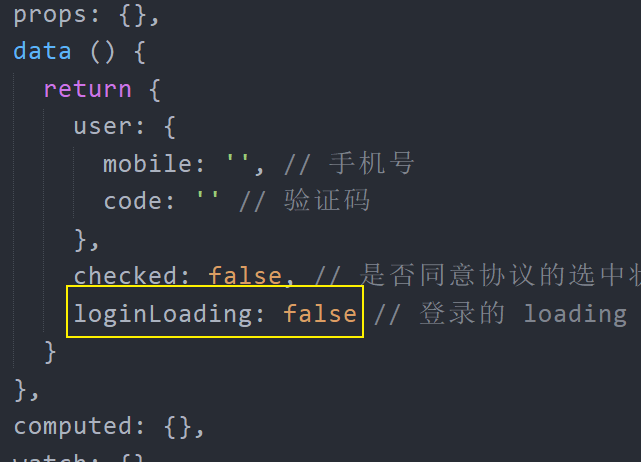
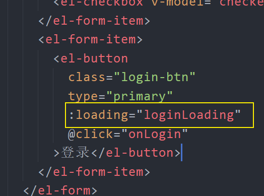
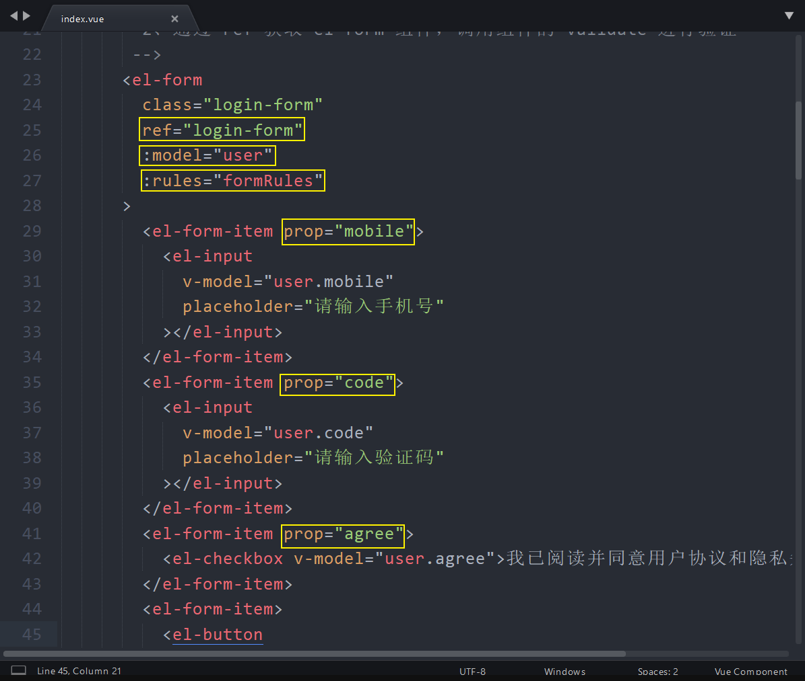
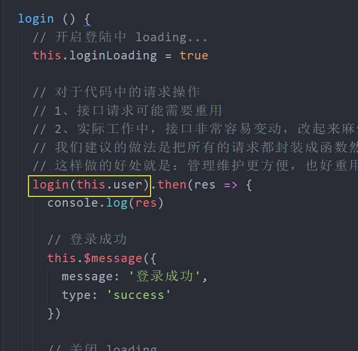

# 二、用户登录

## 功能介绍

测试账号：

- 13911111111
- 246810

也可以通过我们这个应用的移动端注册一个自己的账号：

地址：http://vue-toutiao-m.lipengzhou.com/#/login

- 手机号：你自己的

- 验证码：
  - 246810
  - 也可以动态接收真实的验证码

## 创建组件并配置路由

1、创建 `src/views/login/index.vue`

```html
<template>
  <div class="login-container">登录页面</div>
</template>

<script>
  export default {
    name: 'LoginIndex',
    components: {},
    props: {},
    data() {
      return {}
    },
    computed: {},
    watch: {},
    created() {},
    mounted() {},
    methods: {}
  }
</script>

<style scoped lang="less"></style>
```

> 自定义代码段：百度一下。
>
> Sublime: Sublime 自定义代码段
>
> Visual Studio Code：Visual Studio Code 代码段

2、将登陆页面组件配置到路由中

```js
import Vue from 'vue'
import VueRouter from 'vue-router'
+ import Login from '@/views/login'

Vue.use(VueRouter)

// 路由配置表
const routes = [
+  {
+    path: '/login',
+    name: 'login',
+    component: Login
+  }
]

const router = new VueRouter({
  routes
})

export default router

```

3、最后手动输入 `/login` 访问测试。

## 页面布局

```html
<template>
  <div class="login-container">
    <!--
      el-form 表单组件
      每个表单项都必须使用 el-form-item 组件包裹
     -->

    <div class="login-form-wrap">
      <div class="login-head">
        <div class="logo"></div>
      </div>
      <el-form class="login-form" ref="form" :model="user">
        <el-form-item>
          <el-input v-model="user.mobile" placeholder="请输入手机号"></el-input>
        </el-form-item>
        <el-form-item>
          <el-input v-model="user.code" placeholder="请输入验证码"></el-input>
        </el-form-item>
        <el-form-item>
          <el-checkbox v-model="checked"
            >我已阅读并同意用户协议和隐私条款</el-checkbox
          >
        </el-form-item>
        <el-form-item>
          <el-button class="login-btn" type="primary" @click="onSubmit"
            >登录</el-button
          >
        </el-form-item>
      </el-form>
    </div>
  </div>
</template>

<script>
  export default {
    name: 'LoginIndex',
    components: {},
    props: {},
    data() {
      return {
        user: {
          mobile: '', // 手机号
          code: '' // 验证码
        },
        checked: false // 是否同意协议的选中状态
      }
    },
    computed: {},
    watch: {},
    created() {},
    mounted() {},
    methods: {
      onSubmit() {
        console.log('submit!')
      }
    }
  }
</script>

<style scoped lang="less">
  .login-container {
    position: fixed;
    left: 0;
    top: 0;
    right: 0;
    bottom: 0;
    display: flex;
    flex-direction: column;
    justify-content: center;
    align-items: center;
    background: url('./login_bg.jpg') no-repeat;
    background-size: cover;
    .login-form-wrap {
      min-width: 300px;
      padding: 30px 50px 10px;
      background-color: #fff;
      .login-head {
        display: flex;
        justify-content: center;
        .logo {
          width: 200px;
          height: 57px;
          background: url('./logo_index.png') no-repeat;
          background-size: contain;
        }
      }
      .login-form {
        .login-btn {
          width: 100%;
        }
      }
    }
  }
</style>
```

## 实现基本登录功能

思路：

- 给登陆按钮注册点击事件
- 获取表单数据
- 请求登录
- 处理后端响应结果
  - 成功处理
  - 失败处理

```js
onLogin () {
  // 获取表单数据（根据接口要求绑定数据）
  const user = this.user

  // 表单验证

  // 验证通过，提交登录
  request({
    method: 'POST',
    url: '/mp/v1_0/authorizations',
    // data 用来设置 POST 请求体
    data: user
  }).then(res => {
    console.log(res)

    // 登录成功
  }).catch(err => {
    console.log('登录失败', err)
    // 登录失败
  })
}
```

## 登录消息提示

> 参考：[Message 消息提示](https://element.eleme.cn/#/zh-CN/component/message)

```js
// 普通提示消息
this.$message('这是一条消息提示')

// 成功提示消息
this.$message({
  message: '恭喜你，这是一条成功消息',
  type: 'success'
})

// 警告提示消息
this.$message({
  message: '警告哦，这是一条警告消息',
  type: 'warning'
})

// 错误提示消息
this.$message.error('错了哦，这是一条错误消息')
```

下面是我们给登录功能增加的消息提示：

```js
onLogin () {
  // 获取表单数据（根据接口要求绑定数据）
  const user = this.user

  // 表单验证

  // 验证通过，提交登录
  request({
    method: 'POST',
    url: '/mp/v1_0/authorizations',
    // data 用来设置 POST 请求体
    data: user
  }).then(res => {
    console.log(res)

    // 登录成功
    this.$message({
      message: '登录成功',
      type: 'success'
    })
  }).catch(err => { // 登录失败
    console.log('登录失败', err)
    this.$message.error('登录失败，手机号或验证码错误')
  })
}
```

## 登录中 loading 提示

两个作用：

- 防止网络请求慢出现用户多次点击触发登录请求
  - 一种方式是在请求期间把交互按钮禁用不允许被点击
  - 一种方式就是展示 loading 不允许被点击
- 交互反馈

1、在 data 中添加数据用来控制登录按钮的 loading 状态



2、给登录按钮绑定 loading 状态



3、在登录处理中

```js
onLogin () {
  // 获取表单数据（根据接口要求绑定数据）
  const user = this.user

  // 表单验证

  // 验证通过，提交登录

  // 开启登陆中 loading...
  this.loginLoading = true

  request({
    method: 'POST',
    url: '/mp/v1_0/authorizations',
    // data 用来设置 POST 请求体
    data: user
  }).then(res => {
    console.log(res)

    // 登录成功
    this.$message({
      message: '登录成功',
      type: 'success'
    })

    // 关闭 loading
    this.loginLoading = false
  }).catch(err => { // 登录失败
    console.log('登录失败', err)
    this.$message.error('登录失败，手机号或验证码错误')

    // 关闭 loading
    this.loginLoading = false
  })
}
```

## 表单验证

参考文档：[Element - Form 表单 -> 表单验证](https://element.eleme.cn/#/zh-CN/component/form#form-biao-dan)

Form 组件提供了表单验证的功能，只需要通过 `rules` 属性传入约定的验证规则，并将 Form-Item 的 `prop` 属性设置为需校验的字段名即可。校验规则参见 [async-validator](https://github.com/yiminghe/async-validator)

下面是内置的基本验证规则：

| 规则     | 说明                                                                                                                                                                                                        |
| -------- | ----------------------------------------------------------------------------------------------------------------------------------------------------------------------------------------------------------- |
| required | 必须的，例如校验内容是否非空                                                                                                                                                                                |
| pattern  | 正则表达式，例如校验手机号码格式、校验邮箱格式                                                                                                                                                              |
| range    | 使用 min 和 max 属性定义范围。对于字符串和数组类型，将根据长度进行比较，对于数字类型，数字不得小于 min，也不得大于 max。                                                                                    |
| len      | 要验证字段的确切长度，请指定 len 属性。对于字符串和数组类型，对 length 属性执行比较，对于数字类型，此属性指示数字的完全匹配，即，它可能仅严格等于 len。如果 len 属性与最小和最大范围属性组合，则 len 优先。 |
| enum     | 要从可能值列表中验证值，请使用带枚举属性的枚举类型，列出该字段的有效值，例如：<br />var descriptor = { role: {type: "enum", enum: ['admin', 'user', 'guest']} }                                             |

如果内置的校验规则不满足，也可以自定义校验规则，参见：[Element - Form 表单 -> 自定义校验规则](https://element.eleme.cn/#/zh-CN/component/form#form-biao-dan)

下面我们项目中登录表单验证的配置。

（1）模板中的配置



> 1、给 el-from 组件绑定 model 为表单数据对象
>
> 2、给需要验证的表单项 el-form-item 绑定 prop 属性
>
> - 注意：prop 属性需要指定表单对象中的数据名称
>
> 3、通过 el-from 组件的 rules 属性配置验证规则
>
> 4、ref 的作用主要用来获取表单组件手动触发验证

（2）在 data 中定义验证规则

```js
formRules: { // 表单验证规则配置
  // 要验证的数据名称：规则列表[]
  mobile: [
    { required: true, message: '请输入手机号', trigger: 'change' },
    { pattern: /^1[3|5|7|8|9]\d{9}$/, message: '请输入正确的号码格式', trigger: 'change' }
  ],
    code: [
      { required: true, message: '验证码不能为空', trigger: 'change' },
      { pattern: /^\d{6}$/, message: '请输入正确的验证码格式' }
    ],
      agree: [
        {
          // 自定义校验规则：https://element.eleme.cn/#/zh-CN/component/form#zi-ding-yi-xiao-yan-gui-ze
          // 验证通过：callback()
          // 验证失败：callback(new Error('错误消息'))
          validator: (rule, value, callback) => {
            if (value) {
              callback()
            } else {
              callback(new Error('请同意用户协议'))
            }
          },
          // message: '请勾选同意用户协议',
          trigger: 'change'
        }
      ]
}
```

（3）在登录的时候调用验证

```js
onLogin () {
  // 获取表单数据（根据接口要求绑定数据）
  // const user = this.user

  // 表单验证
  // validate 方法是异步的
  this.$refs['login-form'].validate(valid => {
    // 如果表单验证失败，停止请求提交
    if (!valid) {
      return
    }

    // 验证通过，请求登录
    this.login()
  })
},

login () {
  // 开启登陆中 loading...
  this.loginLoading = true

  request({
    method: 'POST',
    url: '/mp/v1_0/authorizations',
    // data 用来设置 POST 请求体
    data: this.user
  }).then(res => {
    console.log(res)

    // 登录成功
    this.$message({
      message: '登录成功',
      type: 'success'
    })

    // 关闭 loading
    this.loginLoading = false
  }).catch(err => { // 登录失败
    console.log('登录失败', err)
    this.$message.error('登录失败，手机号或验证码错误')

    // 关闭 loading
    this.loginLoading = false
  })
}
```

## 封装请求模块

对于项目中的请求操作：

- 接口请求可能需要重用
- 实际工作中，接口非常容易变动，改起来麻烦

我们建议的做法是把所有的请求都封装成函数然后统一的组织到模块中进行管理，这样做的好处就是：管理维护更方便，也好重用。

下面是我们优化封装请求的具体操作。

1、创建 `src/api/user.js`，封装登录请求方法

```js
/**
 * 用户相关请求模块
 */
import request from '@/utils/request'

// 用户登录
export const login = (data) => {
  return request({
    method: 'POST',
    url: '/mp/v1_0/authorizations',
    // data 用来设置 POST 请求体
    data
  })
}
```

2、在登录组件中加载使用

```js
import { login } from '@/api/user'
```



3、最后测试登录功能是否正常

## 总结
