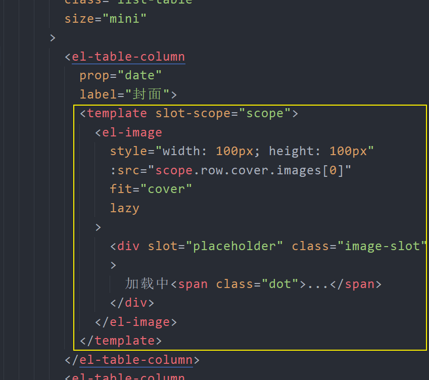
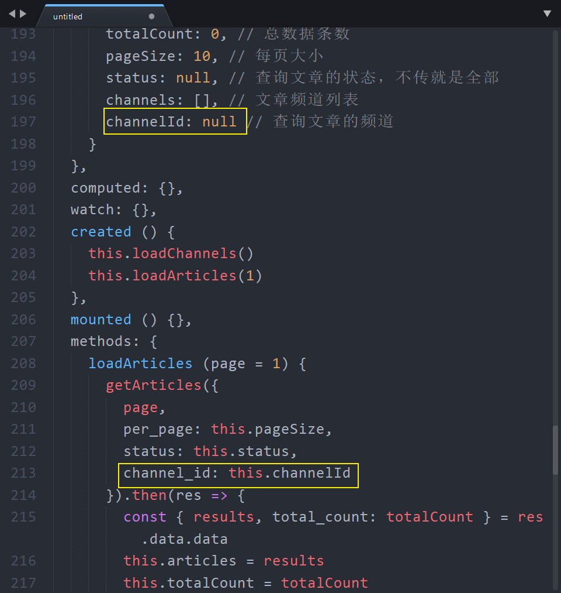

# 四、文章列表模块

## 创建组件并配置路由

1、创建 `src/views/article/index.vue`

```html
<template>
  <div class="article-container">内容管理</div>
</template>

<script>
export default {
  name: 'ArticleIndex',
  components: {},
  props: {},
  data () {
    return {}
  },
  computed: {},
  watch: {},
  created () {},
  mounted () {},
  methods: {}
}
</script>

<style scoped lang="less"></style>

```

2、配置路由


3、访问测试。

## 页面布局

```html
<template>
  <div class="article-container">
    <el-card class="filter-card">
      <div slot="header" class="clearfix">
        <!-- 面包屑路径导航 -->
        <el-breadcrumb separator-class="el-icon-arrow-right">
          <el-breadcrumb-item to="/">首页</el-breadcrumb-item>
          <el-breadcrumb-item>内容管理</el-breadcrumb-item>
        </el-breadcrumb>
        <!-- /面包屑路径导航 -->
      </div>
      <!-- 数据筛选表单 -->
      <el-form ref="form" :model="form" label-width="40px" size="mini">
        <el-form-item label="状态">
          <el-radio-group v-model="form.resource">
            <el-radio label="全部"></el-radio>
            <el-radio label="草稿"></el-radio>
            <el-radio label="待审核"></el-radio>
            <el-radio label="审核通过"></el-radio>
            <el-radio label="审核失败"></el-radio>
            <el-radio label="已删除"></el-radio>
          </el-radio-group>
        </el-form-item>
        <el-form-item label="频道">
          <el-select v-model="form.region" placeholder="请选择频道">
            <el-option label="区域一" value="shanghai"></el-option>
            <el-option label="区域二" value="beijing"></el-option>
          </el-select>
        </el-form-item>
        <el-form-item label="日期">
          <el-date-picker
            v-model="form.date1"
            type="datetimerange"
            start-placeholder="开始日期"
            end-placeholder="结束日期"
            :default-time="['12:00:00']">
          </el-date-picker>
        </el-form-item>
        <el-form-item>
          <el-button type="primary" @click="onSubmit">查询</el-button>
        </el-form-item>
      </el-form>
      <!-- /数据筛选表单 -->
    </el-card>

    <el-card class="box-card">
      <div slot="header" class="clearfix">
        根据筛选条件共查询到 46147 条结果：
      </div>
      <!-- 数据列表 -->
      <el-table
        :data="tableData"
        stripe
        style="width: 100%"
        class="list-table"
        size="mini"
      >
        <el-table-column
          prop="date"
          label="日期"
          width="180">
        </el-table-column>
        <el-table-column
          prop="name"
          label="姓名"
          width="180">
        </el-table-column>
        <el-table-column
          prop="address"
          label="地址">
        </el-table-column>
      </el-table>
      <!-- /数据列表 -->

      <!-- 列表分页 -->
      <el-pagination
        layout="prev, pager, next"
        background
        :total="1000">
      </el-pagination>
      <!-- /列表分页 -->
    </el-card>
  </div>
</template>

<script>
export default {
  name: 'ArticleIndex',
  components: {},
  props: {},
  data () {
    return {
      form: {
        name: '',
        region: '',
        date1: '',
        date2: '',
        delivery: false,
        type: [],
        resource: '',
        desc: ''
      },
      tableData: [{
        date: '2016-05-02',
        name: '王小虎',
        address: '上海市普陀区金沙江路 1518 弄'
      }, {
        date: '2016-05-04',
        name: '王小虎',
        address: '上海市普陀区金沙江路 1517 弄'
      }, {
        date: '2016-05-01',
        name: '王小虎',
        address: '上海市普陀区金沙江路 1519 弄'
      }, {
        date: '2016-05-03',
        name: '王小虎',
        address: '上海市普陀区金沙江路 1516 弄'
      }]
    }
  },
  computed: {},
  watch: {},
  created () {},
  mounted () {},
  methods: {
    onSubmit () {
      console.log('submit!')
    }
  }
}
</script>

<style scoped lang="less">
.filter-card {
  margin-bottom: 30px;
}

.list-table {
  margin-bottom: 20px;
}
</style>

```

## 展示所有文章列表

- 找到数据接口
- 封装请求方法
- 在组件中初始调用获取数据
- 把数据绑定到模板中

### 请求获取文章列表数据

1、创建 `src/api/article.js`

```js
/**
 * 文章相关请求模块
 */
import request from '@/utils/request'

/**
 * 获取文章列表
 */
export const getArticles = params => {
  return request({
    method: 'GET',
    url: '/mp/v1_0/articles',
    // Body 参数使用 data 设置
    // Query 参数使用 params 设置
    // Headers 参数使用 headers 设置
    params
  })
}

```


2、在文章组件中请求获取数据


### 表格组件数据绑定

```html
<!-- 数据列表 -->
<!--
  Table 表格组件
  1、把需要展示的数组列表数据绑定给 table 组件的 data 属性
    注意：你不用去 v-for 遍历，它自己会遍历
  2、设计表格列 el-table-column
    width 可以设定表格列的宽度
    label 可以设定列的标题
    prop  用来设定要渲染的列表项数据字段，只能展示文本

  3、表格列默认只能渲染普通文本，如果需要展示其它内容，例如放个按钮啊、放个图片啊，那就需要自定义表格列模板了：https://element.eleme.cn/#/zh-CN/component/table#zi-ding-yi-lie-mo-ban
 -->
<el-table
  :data="articles"
  stripe
  style="width: 100%"
  class="list-table"
  size="mini"
>
  <el-table-column
    prop="date"
    label="封面">
  </el-table-column>
  <el-table-column
    prop="title"
    label="标题">
  </el-table-column>
  <el-table-column
    label="状态">
    <!-- 如果需要在自定义列模板中获取当前遍历项数据，那么就在 template 上声明 slot-scope="scope" -->
    <template slot-scope="scope">
      <el-tag v-if="scope.row.status === 0" type="warning">草稿</el-tag>
      <el-tag v-else-if="scope.row.status === 1">待审核</el-tag>
      <el-tag v-else-if="scope.row.status === 2" type="success">审核通过</el-tag>
      <el-tag v-else-if="scope.row.status === 3" type="danger">审核失败</el-tag>
      <el-tag v-else-if="scope.row.status === 4" type="info">已删除</el-tag>
    </template>
  </el-table-column>
  <el-table-column
    prop="pubdate"
    label="发布时间">
  </el-table-column>
  <el-table-column
    label="操作">
    <!-- 如果需要自定义表格列模板，则把需要自定义的内容放到 template 里面 -->
    <template>
      <el-button
        size="mini"
        circle
        icon="el-icon-edit"
        type="primary"
      ></el-button>
      <el-button
        size="mini"
        type="danger"
        icon="el-icon-delete"
        circle
      ></el-button>
    </template>
  </el-table-column>
</el-table>
<!-- /数据列表 -->
```

### 优化文章状态展示处理

1、在数据 data 中添加如下数据

```js
articleStatus: [
  { status: 0, text: '草稿', type: 'info' }, // 0
  { status: 1, text: '待审核', type: '' }, // 1
  { status: 2, text: '审核通过', type: 'success' }, // 2
  { status: 3, text: '审核失败', type: 'warning' }, // 3
  { status: 4, text: '已删除', type: 'danger' } // 4
]
```

2、在模板中绑定使用


### 处理文章封面展示

> 这里是对 element 中 [image 图片组件](https://element.eleme.cn/#/zh-CN/component/image) 的使用.



## 数据分页

```
分页？

分页的目的是为了缓解查询数据的压力，提高页面的响应速度，让用户更快的看到页面内容。

假如是固定的数据，例如 10 条，20 条，以后不会增加了。那就没有必要分页，没有意义。

如果是动态产生的数据，例如文章列表，商品列表、评论列表。。。数据量增加的越来越多。100w、1000w、数据量很大响应速度就很慢，数据量很大页面渲染也会变慢，。 

所以分页就是用来缓解数据查询和渲染的压力的。

数据库中有 100 条数据：

- 第几页
- 每页大小

后端会从数据库中获取数据，

假设每页10条数据

- 请求第1页数据， 1-10
- 请求第2页数据， 11-20
- 请求第3页数据， 21-30
- ...

然后后端通过接口提供给前端使用。

- page      页码，默认第1页
- per_page  每页大小，默认每页 10 条数据

数据筛选：

- 接口的参数
- 通过表单的交互得到接口参数

```


1、传递分页参数


2、注册分页组件的 `current-change` 事件


3、当页码改变，请求对应页码数据


## 总页码处理

1、将数据列表接口中返回的总数据条数存储到 data 数据中


2、将总记录数和每页大小绑定到分页组件


## 数据筛选

把视图处理成接口需要的数据提交给后端。

### 筛选状态

1、在 data 中初始化 status 并传递给请求方法


> 注：axios 不会发送值为 null、undefined 类型的数据，所以初始化为 null。

2、处理表单绑定获取 status 数据


3、点击查询的时候，调用 `loadArticles` 方法加载数据


### 筛选频道

一、在下拉列表中展示频道列表

1、在 `api/article.js` 中封装请求获取文章频道的数据接口

```js
/**
 * 获取文章频道
 */
export const getArticleChannels = () => {
  return request({
    method: 'GET',
    url: '/mp/v1_0/channels'
  })
}
```

2、在文章组件中请求获取频道数据


3、将频道数据遍历展示到表单选择器中


二、处理筛选

1、在 data 中初始化数据并传递给请求方法



2、将数据绑定到选择器上


### 筛选时间

1、在 data 中添加数据并传递给请求参数


2、将数据绑定到日期选择器上


> value-format， 可选，绑定值的格式。不指定则绑定值为 Date 对象
>
> 具体格式详见： [日期格式](https://element.eleme.cn/#/zh-CN/component/date-picker#ri-qi-ge-shi)


## 加载中 loading

1、初始化 loading 数据


2、设置表格的 loading 状态


3、设置加载中禁用分页组件


4、设置加载中禁用查询按钮


## 删除文章

### 解决后端返回数据中的大数字问题

JavaScript 能够准确表示的整数范围在`-2^53`到`2^53`之间（不含两个端点），超过这个范围，无法精确表示这个值，这使得 JavaScript 不适合进行科学和金融方面的精确计算。

```javascript
Math.pow(2, 53) // 9007199254740992

9007199254740992  // 9007199254740992
9007199254740993  // 9007199254740992

Math.pow(2, 53) === Math.pow(2, 53) + 1
// true
```

上面代码中，超出 2 的 53 次方之后，一个数就不精确了。
ES6 引入了`Number.MAX_SAFE_INTEGER`和`Number.MIN_SAFE_INTEGER`这两个常量，用来表示这个范围的上下限。

```javascript
Number.MAX_SAFE_INTEGER === Math.pow(2, 53) - 1
// true
Number.MAX_SAFE_INTEGER === 9007199254740991
// true

Number.MIN_SAFE_INTEGER === -Number.MAX_SAFE_INTEGER
// true
Number.MIN_SAFE_INTEGER === -9007199254740991
// true
```

上面代码中，可以看到 JavaScript 能够精确表示的极限。

后端返回的数据一般都是 **JSON 格式的字符串**。

```json
'{ "id": 9007199254740995, "name": "Jack", "age": 18 }'
```

如果这个字符不做任何处理，你能方便的获取到字符串中的指定数据吗？非常麻烦。所以我们要把它转换为 JavaScript 对象来使用就很方便了。

幸运的是 axios 为了方便我们使用数据，它会在内部使用 `JSON.parse()` 把后端返回的数据转为 JavaScript 对象。

```javascript
// { id: 9007199254740996, name: 'Jack', age: 18 }
JSON.parse('{ "id": 9007199254740995, "name": "Jack", "age": 18 }')
```

可以看到，超出安全整数范围的 id 无法精确表示，这个问题并不是 axios 的错。

了解了什么是大整数的概念，接下来的问题是如何解决？

[json-bigint](https://github.com/sidorares/json-bigint) 是一个第三方包，它可以帮我们很好的处理这个问题。

使用它的第一步就是把它安装到你的项目中。

```shell
npm i json-bigint
```

下面是使用它的一个简单示例。

```javascript
import JSONbig from 'json-bigint'

const str = '{ "id": 1253585734669959168 }'

console.log(JSON.parse(str)) // 1253585734669959200

// 它会把超出 JS 安全整数范围的数字转为一种类型为 BigNumber 的对象
// 我们在使用的时候需要把这个 BigNumber.toString() 就能得到原来正确的数据了
console.log(JSONbig.parse(str))
console.log(JSONbig.parse(str).id.toString()) // 1253585734669959168

const data = JSONbig.parse(str)

console.log(JSON.stringify(data))
console.log(JSONbig.stringify(data))
```


> json-bigint 会把超出 JS 安全整数范围的数字转为一个 BigNumber 类型的对象，对象数据是它内部的一个算法处理之后的，我们要做的就是在使用的时候转为字符串来使用。


了解了 json-biginit 怎么回事儿之后，下一步是如何配置到我们的项目中？

```
解决思路：

Axios 会在内部使用 JSON.parse 把后端返回的数据转为 JavaScript 数据对象。

所以解决思路就是：不要让 axios 使用 JSON.parse 来转换这个数据，而是使用 json-biginit 来做转换处理。

axios 提供了一个 API：transformResponse

还有需要注意的是：不要使用 13911111111 这个账号来测试删除操作。
为什么？这是后端做了限制，防止你把数据删没了，别人没法测试了，所以使用自己的账户去完整版中添加一些数据然后来到开发版中进行测试。
```

所以我们在 request.js 请求模块中添加处理代码：

```js
/**
 * 基于 axios 封装的请求模块
 */
import axios from 'axios'
import JSONbig from 'json-bigint'

// 创建一个 axios 实例，说白了就是复制了一个 axios
// 我们通过这个实例去发请求，把需要的配置配置给这个实例来处理
const request = axios.create({
  baseURL: 'http://ttapi.research.itcast.cn/', // 请求的基础路径

  // 定义后端返回的原始数据的处理
  // 参数 data 就是后端返回的原始数据（未经处理的 JSON 格式字符串）
  transformResponse: [function (data) {
    // Do whatever you want to transform the data
    // console.log(data)

    // 后端返回的数据可能不是 JSON 格式字符串
    // 如果不是的话，那么 JSONbig.parse 调用就会报错
    // 所以我们使用 try-catch 来捕获异常，处理异常的发生
    try {
      // 如果转换成功，则直接把结果返回
      return JSONbig.parse(data)
    } catch (err) {
      console.log('转换失败', err)
      // 如果转换失败了，则进入这里
      // 我们在这里把数据原封不动的直接返回给请求使用
      return data
    }

    // axios 默认在内部使用 JSON.parse 来转换处理原始数据
    // return JSON.parse(data)
  }]
})

// 请求拦截器
request.interceptors.request.use(
  // 任何所有请求会经过这里
  // config 是当前请求相关的配置信息对象
  // config 是可以修改的
  function (config) {
    const user = JSON.parse(window.localStorage.getItem('user'))

    // 如果有登录用户信息，则统一设置 token
    if (user) {
      config.headers.Authorization = `Bearer ${user.token}`
    }

    // 然后我们就可以在允许请求出去之前定制统一业务功能处理
    // 例如：统一的设置 token

    // 当这里 return config 之后请求在会真正的发出去
    return config
  },
  // 请求失败，会经过这里
  function (error) {
    return Promise.reject(error)
  }
)

// 响应拦截器

// 导出请求方法
export default request

```


> 扩展：ES2020 BigInt
>
> ES2020 引入了一种新的数据类型 BigInt（大整数），来解决这个问题。BigInt 只用来表示整数，没有位数的限制，任何位数的整数都可以精确表示。
>
> 参考链接：
>
> - [https://developer.mozilla.org/zh-CN/docs/Web/JavaScript/Reference/Global_Objects/BigInt](https://developer.mozilla.org/zh-CN/docs/Web/JavaScript/Reference/Global_Objects/BigInt)
> - [http://es6.ruanyifeng.com/#docs/number#BigInt-%E6%95%B0%E6%8D%AE%E7%B1%BB%E5%9E%8B](http://es6.ruanyifeng.com/#docs/number#BigInt-%E6%95%B0%E6%8D%AE%E7%B1%BB%E5%9E%8B)


### 删除操作

1、封装删除文章请求方法

```js
/**
 * 删除文章
 */
export const deleteArticle = articleId => {
  return request({
    method: 'DELETE',
    // 接口文档中的写的路径参数需要在 url 中传递
    // 凡是看见接口路径中有的 :xxx 格式的字段，则需要传递路径参数
    url: `/mp/v1_0/articles/${articleId}`
  })
}
```

2、注册删除按钮点击事件


3、处理函数如下

```js
onDeleteArticle (articleId) {
  console.log(articleId)
  console.log(articleId.toString())
  this.$confirm('确认删除吗？', '删除提示', {
    confirmButtonText: '确定',
    cancelButtonText: '取消',
    type: 'warning'
  }).then(() => {
    // 确认执行这里
    deleteArticle(articleId.toString()).then(res => {
			this.$message({
        message: '删除成功',
        type: 'success'
      })
    })
  }).catch(() => {
    this.$message({
      type: 'info',
      message: '已取消删除'
    })
  })
}
```

### 删除成功更新当前页数据

1、在 data 中初始化 page 用来获取当前页码


2、将 page 绑定到分页组件上用来同步当前页码


3、删除成功，更新当前页数据


