# 五、文章发布

## 创建组件并配置路由

1、创建 `src/views/publish/index.vue` 组件

```html
<template>
  <div class="publish-container">发布文章</div>
</template>

<script>
export default {
  name: 'PublishIndex',
  components: {},
  props: {},
  data () {
    return {}
  },
  computed: {},
  watch: {},
  created () {},
  mounted () {},
  methods: {}
}
</script>

<style scoped lang="less"></style>

```

2、配置页面路由

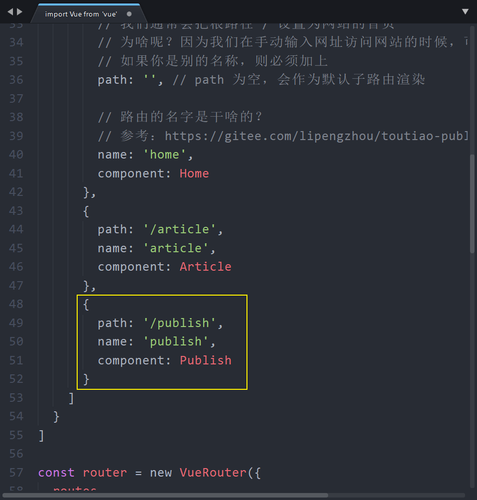

3、访问测试

## 页面布局

```html
<template>
  <div class="publish-container">
    <el-card class="box-card">
      <div slot="header" class="clearfix">
        <!-- 面包屑路径导航 -->
        <el-breadcrumb separator-class="el-icon-arrow-right">
          <el-breadcrumb-item to="/">首页</el-breadcrumb-item>
          <el-breadcrumb-item>发布文章</el-breadcrumb-item>
        </el-breadcrumb>
        <!-- /面包屑路径导航 -->
      </div>
      <el-form ref="form" :model="form" label-width="40px">
        <el-form-item label="标题">
          <el-input v-model="form.name"></el-input>
        </el-form-item>
        <el-form-item label="内容">
          <el-input type="textarea" v-model="form.desc"></el-input>
        </el-form-item>
        <el-form-item label="封面">
          <el-radio-group v-model="form.resource">
            <el-radio label="单图"></el-radio>
            <el-radio label="三图"></el-radio>
            <el-radio label="无图"></el-radio>
            <el-radio label="自动"></el-radio>
          </el-radio-group>
        </el-form-item>
        <el-form-item label="频道">
          <el-select v-model="form.region" placeholder="请选择频道">
            <el-option label="区域一" value="shanghai"></el-option>
            <el-option label="区域二" value="beijing"></el-option>
          </el-select>
        </el-form-item>
        <el-form-item>
          <el-button type="primary" @click="onSubmit">发表</el-button>
          <el-button>存入草稿</el-button>
        </el-form-item>
      </el-form>
    </el-card>
  </div>
</template>

<script>
export default {
  name: 'PublishIndex',
  components: {},
  props: {},
  data () {
    return {
      form: {
        name: '',
        region: '',
        date1: '',
        date2: '',
        delivery: false,
        type: [],
        resource: '',
        desc: ''
      }
    }
  },
  computed: {},
  watch: {},
  created () {},
  mounted () {},
  methods: {
    onSubmit () {
      console.log('submit!')
    }
  }
}
</script>

<style scoped lang="less"></style>

```

## 处理表单数据绑定

> 思路：根据后端接口的要求处理绑定数据绑定

```html
<template>
  <div class="publish-container">
    <el-card class="box-card">
      <div slot="header" class="clearfix">
        <!-- 面包屑路径导航 -->
        <el-breadcrumb separator-class="el-icon-arrow-right">
          <el-breadcrumb-item to="/">首页</el-breadcrumb-item>
          <el-breadcrumb-item>发布文章</el-breadcrumb-item>
        </el-breadcrumb>
        <!-- /面包屑路径导航 -->
      </div>
      <el-form ref="form" :model="form" label-width="40px">
        <el-form-item label="标题">
          <el-input v-model="article.title"></el-input>
        </el-form-item>
        <el-form-item label="内容">
          <el-input type="textarea" v-model="article.content"></el-input>
        </el-form-item>
        <el-form-item label="封面">
          <el-radio-group v-model="article.cover.type">
            <el-radio :label="1">单图</el-radio>
            <el-radio :label="3">三图</el-radio>
            <el-radio :label="0">无图</el-radio>
            <el-radio :label="-1">自动</el-radio>
          </el-radio-group>
        </el-form-item>
        <el-form-item label="频道">
          <el-select v-model="form.region" placeholder="请选择频道">
            <el-option label="区域一" value="shanghai"></el-option>
            <el-option label="区域二" value="beijing"></el-option>
          </el-select>
        </el-form-item>
        <el-form-item>
          <el-button type="primary" @click="onSubmit">发表</el-button>
          <el-button>存入草稿</el-button>
        </el-form-item>
      </el-form>
    </el-card>
  </div>
</template>

<script>
export default {
  name: 'PublishIndex',
  components: {},
  props: {},
  data () {
    return {
      form: {
        name: '',
        region: '',
        date1: '',
        date2: '',
        delivery: false,
        type: [],
        resource: '',
        desc: ''
      },
      article: {
        title: '', // 文章标题
        content: '', // 文章内容
        cover: { // 文章封面
          type: 0, // 封面类型 -1:自动，0-无图，1-1张，3-3张
          images: [] // 封面图片的地址
        }
      }
    }
  },
  computed: {},
  watch: {},
  created () {},
  mounted () {},
  methods: {
    onSubmit () {
      console.log('submit!')
    }
  }
}
</script>

<style scoped lang="less"></style>

```


## 处理文章频道数据

一、展示频道列表

1、请求获取频道列表数据

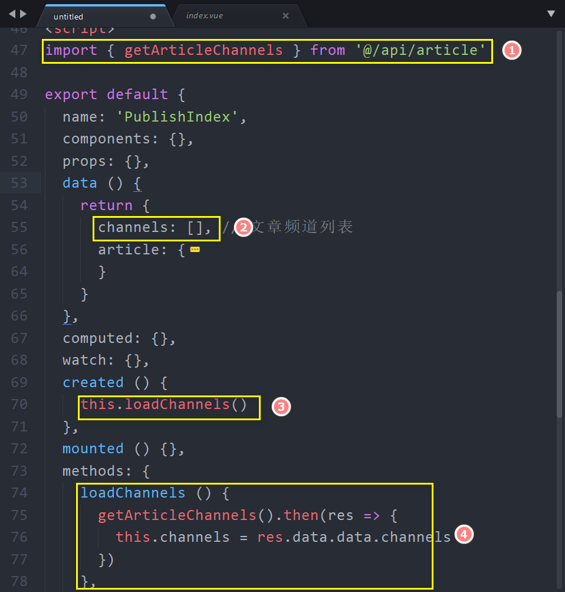

2、绑定到模板中展示

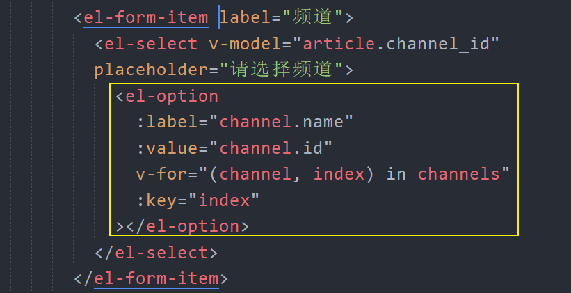


二、将频道绑定到表单元素选择器

1、在 article 中添加频道数据字段

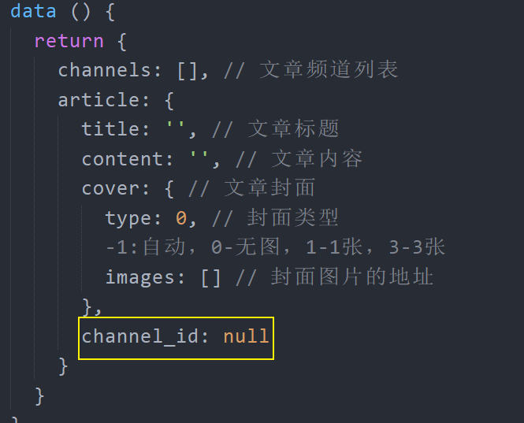

2、将数据绑定到频道选择器中

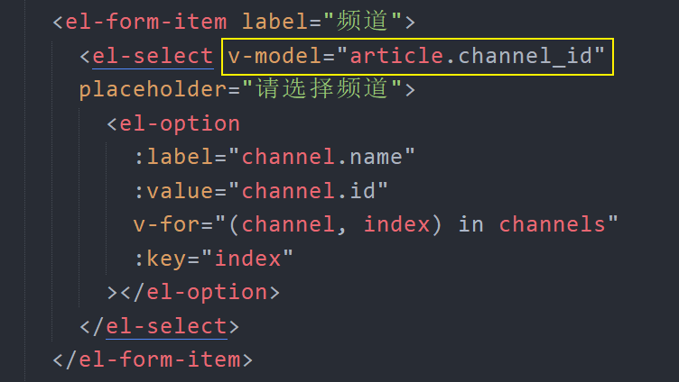


## 发布文章

一、封装数据接口

```js
/**
 * 新建文章
 */
export const addArticle = (data, draft = false) => {
  return request({
    method: 'POST',
    url: '/mp/v1_0/articles',
    params: {
      draft // 是否存为草稿（true 为草稿）
    },
    data
  })
}
```

二、在发布文章组件中请求调用

1、加载请求方法

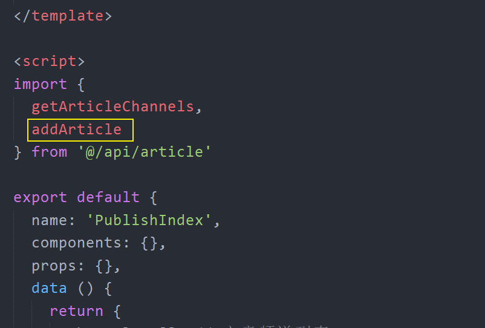

2、给发布和存入草稿绑定事件处理函数

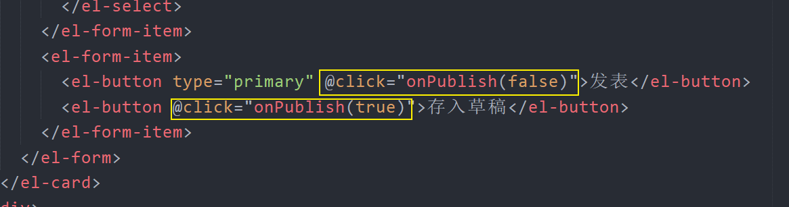

3、处理函数如下

```js
onPublish (draft = false) {
  // 找到数据接口
  // 封装请求方法
  // 请求提交表单
  addArticle(this.article, draft).then(res => {
    // 处理响应结果
    // console.log(res)
    this.$message({
      message: '发布成功',
      type: 'success'
    })
  })
}
```

## 编辑文章

### 展示编辑文章内容

1、封装获取文章的数据接口

```js
/**
 * 获取指定文章
 */
export const getArticle = articleId => {
  return request({
    method: 'GET',
    url: `/mp/v1_0/articles/${articleId}`
  })
}
```


2、点击编辑，导航到发布文章页面

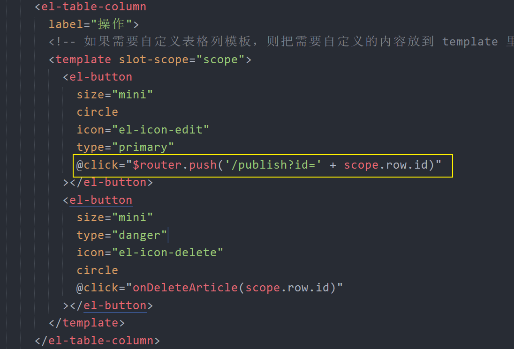

3、在发布文章页面组件中，处理加载编辑文章内容

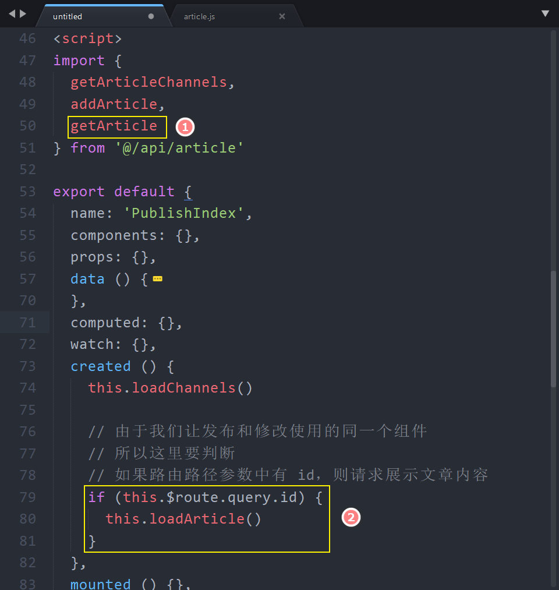

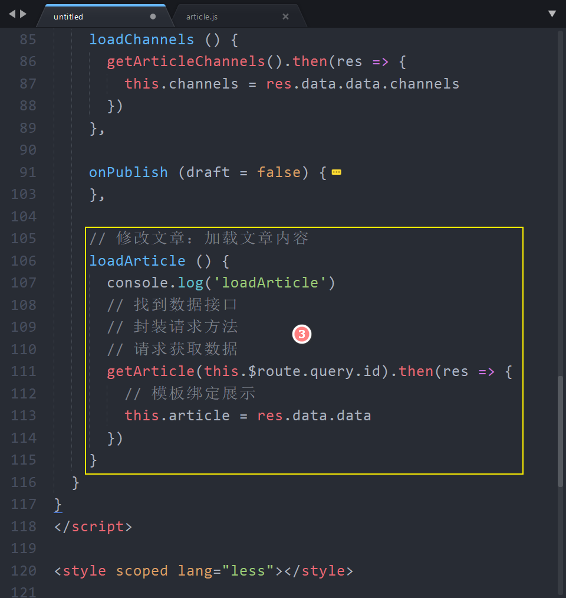

### 提交更新

1、封装更新文章的数据接口

```js
/**
 * 编辑文章
 */
export const updateArticle = (articleId, data, draft = false) => {
  return request({
    method: 'PUT',
    url: `/mp/v1_0/articles/${articleId}`,
    params: {
      draft // 是否存为草稿（true 为草稿）
    },
    data
  })
}
```

2、加载请求方法

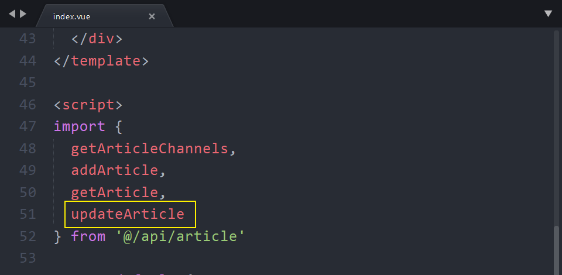

3、修改发布文章的处理逻辑

```js
onPublish (draft = false) {
  // 找到数据接口
  // 封装请求方法
  // 请求提交表单
  // 如果是修改文章，则执行修改操作，否则执行添加操作
  const articleId = this.$route.query.id
  if (articleId) {
    // 执行修改操作
    updateArticle(articleId, this.article, draft).then(res => {
      console.log(res)
      this.$message({
        message: `${draft ? '存入草稿' : '发布'}成功`,
        type: 'success'
      })
      // 跳转到内容管理页面
      this.$router.push('/article')
    })
  } else {
    addArticle(this.article, draft).then(res => {
      // 处理响应结果
      // console.log(res)
      this.$message({
        message: `${draft ? '存入草稿' : '发布'}成功`,
        type: 'success'
      })
      // 跳转到内容管理页面
      this.$router.push('/article')
    })
  }
},
```


## 使用富文本编辑器

基于 Vue 的富文本编辑器有很多，例如官方就收录推荐了一些： https://github.com/vuejs/awesome-vue#rich-text-editing 。

这里我们以 element-tiptap 为例。

- GitHub 仓库：https://github.com/Leecason/element-tiptap
- 在线示例：https://leecason.github.io/element-tiptap
- 中文文档：https://github.com/Leecason/element-tiptap/blob/master/README_ZH.md


1、安装

```shell
npm i element-tiptap
```


2、初始配置

```html
<template>
	<el-tiptap v-model="content" :extensions="extensions"></el-tiptap>
</template>

<script>
 import {
  ElementTiptap,
  Doc,
  Text,
  Paragraph,
  Heading,
  Bold,
  Underline,
  Italic,
  Image,
  Strike,
  ListItem,
  BulletList,
  OrderedList,
  TodoItem,
  TodoList,
  HorizontalRule,
  Fullscreen,
  Preview,
  CodeBlock
} from 'element-tiptap'
import 'element-tiptap/lib/index.css'

export default {
  components: {
    'el-tiptap': ElementTiptap
  },
  data () {
    return {
      content: 'hello world',
      extensions: [
        new Doc(),
        new Text(),
        new Paragraph(),
        new Heading({ level: 3 }),
        new Bold({ bubble: true }), // 在气泡菜单中渲染菜单按钮
        new Image(),
        new Underline(), // 下划线
        new Italic(), // 斜体
        new Strike(), // 删除线
        new HorizontalRule(), // 华丽的分割线
        new ListItem(),
        new BulletList(), // 无序列表
        new OrderedList(), // 有序列表
        new TodoItem(),
        new TodoList(),
        new Fullscreen(),
        new Preview(),
        new CodeBlock()
      ]
    }
  }
}
</script>

```


## 处理富文本编辑器中的图片

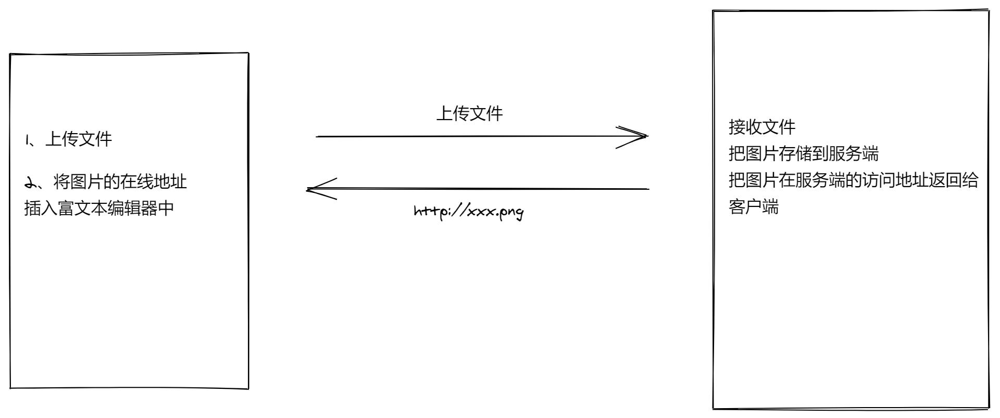

1、创建 `src/api/image.js` 封装数据接口

```js
/**
 * 素材请求相关模块
 */

import request from '@/utils/request'

/**
 * 上传图片素材
 */
export const uploadImage = data => {
  return request({
    method: 'POST',
    url: '/mp/v1_0/user/images',
    // 一般文件上传的接口都要求把请求头中的 Content-Type 设置为 multipart/form-data，但是我们使用 axios 上传文件的话不需要手动设置，你只要给 data 一个 FormData 对象即可。
    // new FormData()
    data
  })
}

```

2、自定义图片上传到服务器

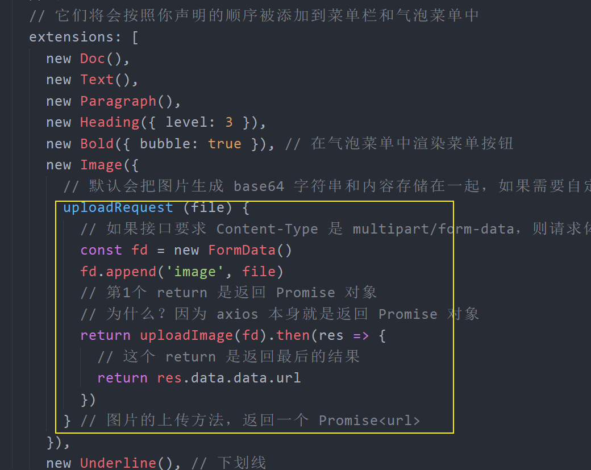


## 表单验证处理

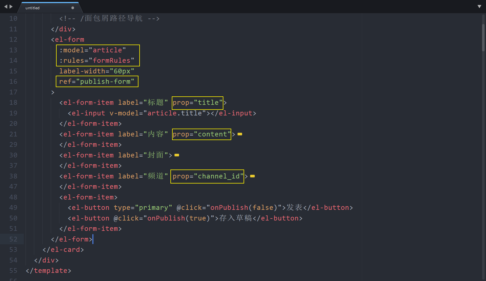

验证规则配置对象：

```js
formRules: {
  title: [
    { required: true, message: '请输入文章标题', trigger: 'blur' },
    { min: 5, max: 30, message: '长度在 5 到 30 个字符', trigger: 'blur' }
  ],
    content: [
      // { required: true, message: '请输入文章内容', trigger: 'change' }
      {
        validator (rule, value, callback) {
          console.log('content validator')
          if (value === '<p></p>') {
            // 验证失败
            callback(new Error('请输入文章内容'))
          } else {
            // 验证通过
            callback()
          }
        }
      },
      { required: true, message: '请输入文章内容', trigger: 'blur' }
    ],
      channel_id: [
        { required: true, message: '请选择文章频道' }
      ]
}
```


## 文章封面

> 该业务功能比较复杂，需要自定义封装组件，所以放到项目最后讲解。

1、创建 `src/views/publish/components/upload-image.vue` 组件并写入

```html
<template>
  <div>上传图片组件</div>
</template>

<script>
  export default {
    name: "UploadImage",
    components: {},
    props: {},
    data() {
      return {};
    },
    computed: {},
    watch: {},
    created() {},
    methods: {}
  };
</script>

<style scoped></style>
```

2、在文章发布中加载使用

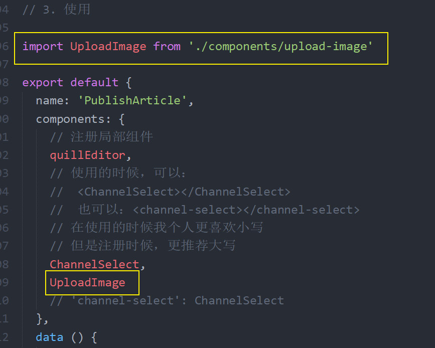

> 注册

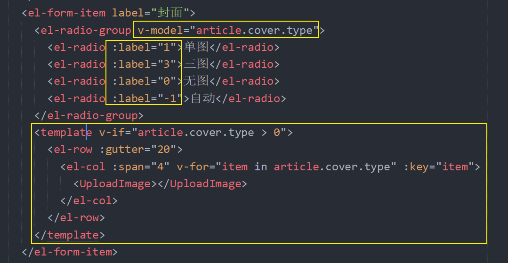

> 在模板中使用

### 使用对话框

```html
<template>
  <div class="upload-image">
    <div class="preview" @click="centerDialogVisible=true">
      <!--  -->
      <i class="el-icon-plus avatar-uploader-icon"></i>
    </div>
    <!--
      visible 控制对话框的显示和隐藏
     -->
    <el-dialog
      title="请选择文章封面图片"
      :visible.sync="centerDialogVisible"
      width="30%"
      center
    >
      <span slot="footer" class="dialog-footer">
        <el-button @click="centerDialogVisible = false">取 消</el-button>
        <el-button type="primary" @click="centerDialogVisible = false"
          >确 定</el-button
        >
      </span>
    </el-dialog>
  </div>
</template>

<script>
  export default {
    name: "UploadImage",
    components: {},
    props: {},
    data() {
      return {
        centerDialogVisible: false
      };
    },
    computed: {},
    watch: {},
    created() {},
    methods: {}
  };
</script>

<style scoped>
  .upload-image {
    border: 1px dashed #d9d9d9;
    border-radius: 6px;
    cursor: pointer;
    position: relative;
    overflow: hidden;
  }

  .upload-image .el-upload:hover {
    border-color: #409eff;
  }

  .avatar-uploader-icon {
    font-size: 28px;
    color: #8c939d;
    width: 178px;
    height: 178px;
    line-height: 178px;
    text-align: center;
  }

  .avatar {
    width: 178px;
    height: 178px;
    display: block;
  }
</style>
```

### 展示素材库

```html
<template>
  <div class="upload-image">
    <div class="preview" @click="onUploadShow">
      <!--  -->
      <i class="el-icon-plus avatar-uploader-icon"></i>
    </div>
    <!--
      visible 控制对话框的显示和隐藏
     -->
    <el-dialog
      title="请选择文章封面图片"
      :visible.sync="centerDialogVisible"
      width="50%"
      center
    >
      <!-- 标签导航 -->
      <!--
        el-tabs 组件
          v-model 双向绑定
            数据驱动视图：当绑定数据发生改变，激活的标签页受影响
            视图影响数据：当标签改变的时候，标签的 name 会同步到数据中
          label 标签的标题
          name 相当于标签的 id
       -->
      <el-tabs v-model="activeName">
        <el-tab-pane label="素材库" name="first">
          <!-- 标签内容写到里面来 -->
          <!--
            radio 有个 change 事件
            当选择的 radio 改变的时候会触发
           -->
          <el-radio-group v-model="activeImage" @change="loadImages">
            <el-radio label="all">全部</el-radio>
            <el-radio label="collect">收藏</el-radio>
          </el-radio-group>
          <el-row :gutter="20">
            <el-col :span="6" v-for="item in images" :key="item.id">
              
            </el-col>
          </el-row>
        </el-tab-pane>
        <el-tab-pane label="上传图片" name="second">配置管理</el-tab-pane>
      </el-tabs>
      <!-- /标签导航 -->
      <span slot="footer" class="dialog-footer">
        <el-button @click="centerDialogVisible = false">取 消</el-button>
        <el-button type="primary" @click="centerDialogVisible = false"
          >确 定</el-button
        >
      </span>
    </el-dialog>
  </div>
</template>

<script>
  export default {
    name: "UploadImage",
    components: {},
    props: {},
    data() {
      return {
        centerDialogVisible: false, // 对话框的显示状态
        activeName: "first", // 激活的标签页
        activeImage: "all", // 激活的图片筛选类型
        images: []
      };
    },
    computed: {},
    watch: {},
    created() {
      console.log(123);
    },
    methods: {
      onUploadShow() {
        // 请求加载数据
        this.loadImages();

        // 显示弹窗
        this.centerDialogVisible = true;
      },

      loadImages() {
        this.$axios({
          method: "GET",
          url: "/user/images",
          params: {
            // this.activeImage 双向绑定了 radio 选择框组
            // 所以获取 this.activeImage 也就是在获取选中的那个 radio 的状态
            collect: this.activeImage === "collect" // 是否获取收藏图片
          }
        })
          .then(res => {
            this.images = res.data.data.results;
          })
          .catch(err => {
            console.log(err);
          });
      }
    }
  };
</script>

<style scoped>
  .upload-image {
    border: 1px dashed #d9d9d9;
    border-radius: 6px;
    cursor: pointer;
    position: relative;
    overflow: hidden;
  }

  .upload-image .el-upload:hover {
    border-color: #409eff;
  }

  .avatar-uploader-icon {
    font-size: 28px;
    color: #8c939d;
    width: 178px;
    height: 178px;
    line-height: 178px;
    text-align: center;
  }

  .avatar {
    width: 178px;
    height: 178px;
    display: block;
  }
</style>
```

### 处理选择图片

1、添加一个数据字段用来存储当前点击的图片项的索引

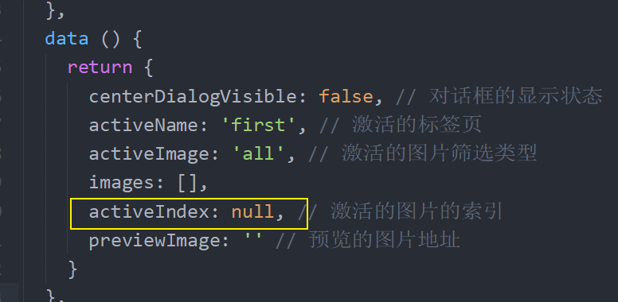

2、模板绑定

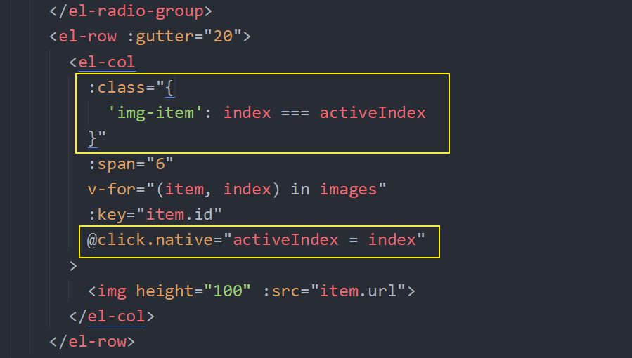

### 数据绑定

1、在父组件中绑定数组元素给图片上传组件

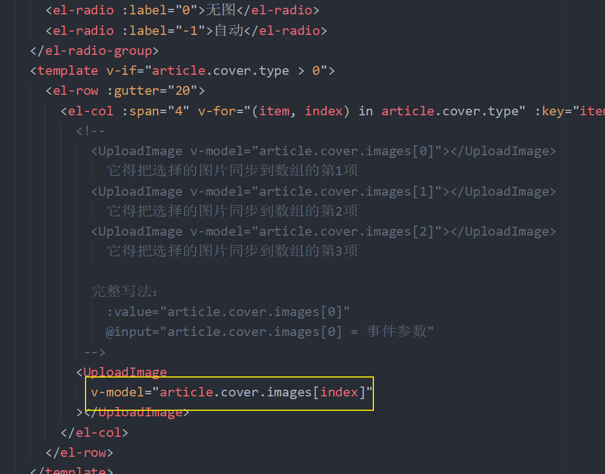

2、在上传图片组件中

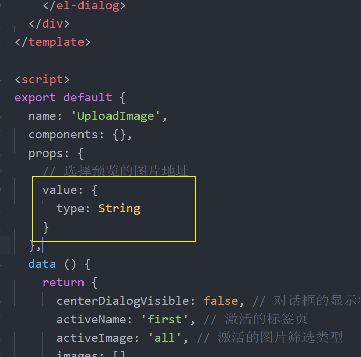

> 声明 value 接收数据

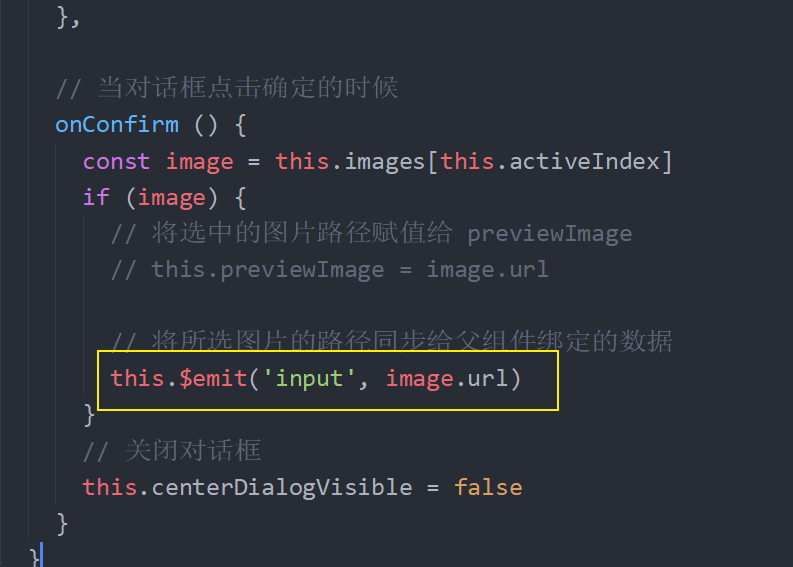

> 点击对话框确认触发：将所选的图片路径发送给父组件

### 上传图片

1、添加上传图片组件

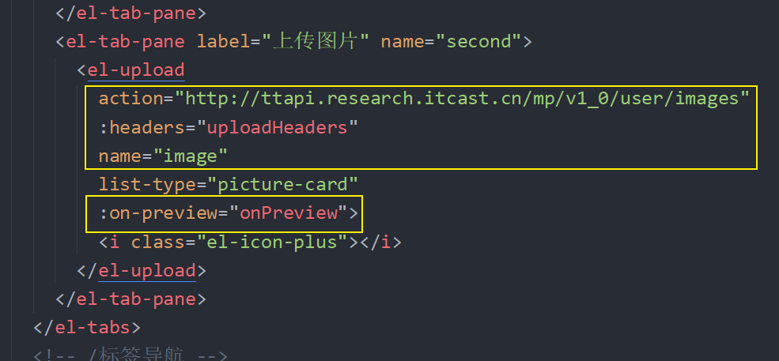

2、记录选择的上传图片

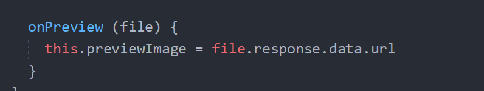

3、对话框确定的时候

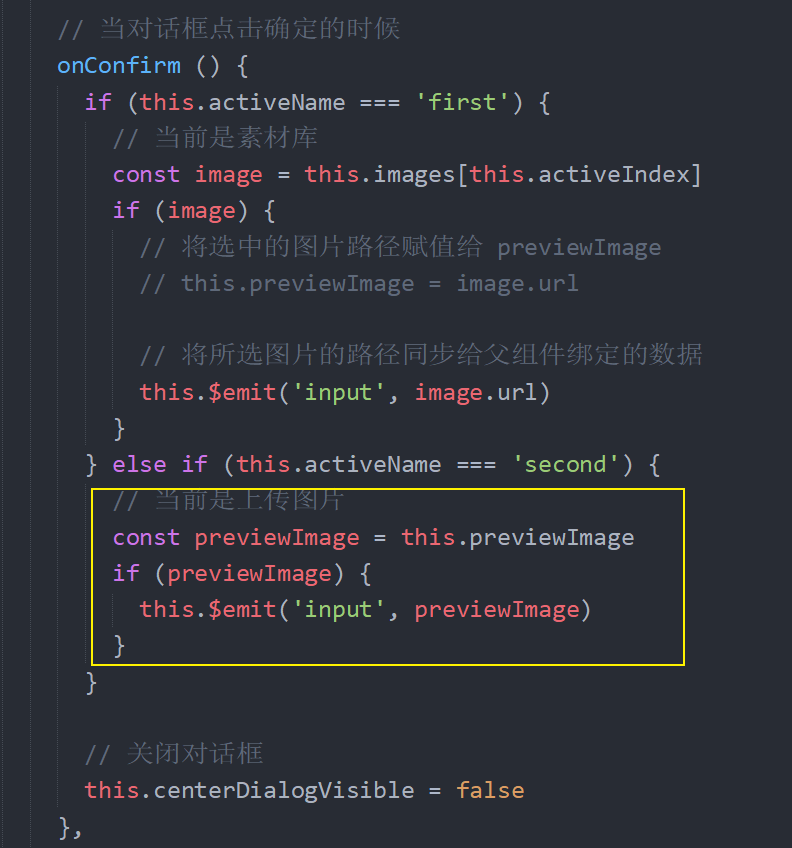


## 禁用路由缓存

我们发现一个小问题，从编辑文章导航到发布文章，表单内容并没有被清空，这是因为两个路由共用的同一个组件，两者之间相互跳转的时候，原来的组件实例会被复用。 因为两个路由都渲染同个组件，比起销毁再创建，复用则显得更加高效。**不过，这也意味着组件的生命周期钩子不会再被调用**。

路由默认提供的这个功能的用意是好的，但是有时候却会带来问题，解决方案就是：**禁用缓存**。

在路由出口 `router-view` 上添加一个唯一的 `key` 即可。

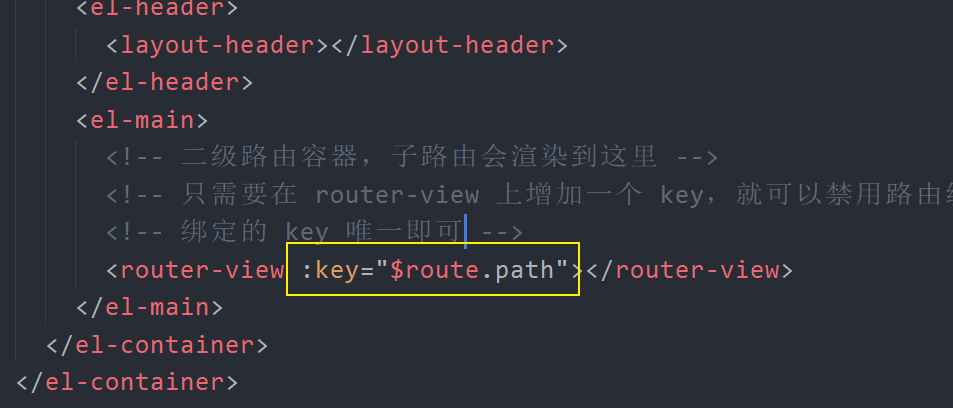

> 详细内容请查阅官方文档：[响应路由参数的变化](<[https://router.vuejs.org/zh/guide/essentials/dynamic-matching.html#%E5%93%8D%E5%BA%94%E8%B7%AF%E7%94%B1%E5%8F%82%E6%95%B0%E7%9A%84%E5%8F%98%E5%8C%96](https://router.vuejs.org/zh/guide/essentials/dynamic-matching.html#响应路由参数的变化)>)。
