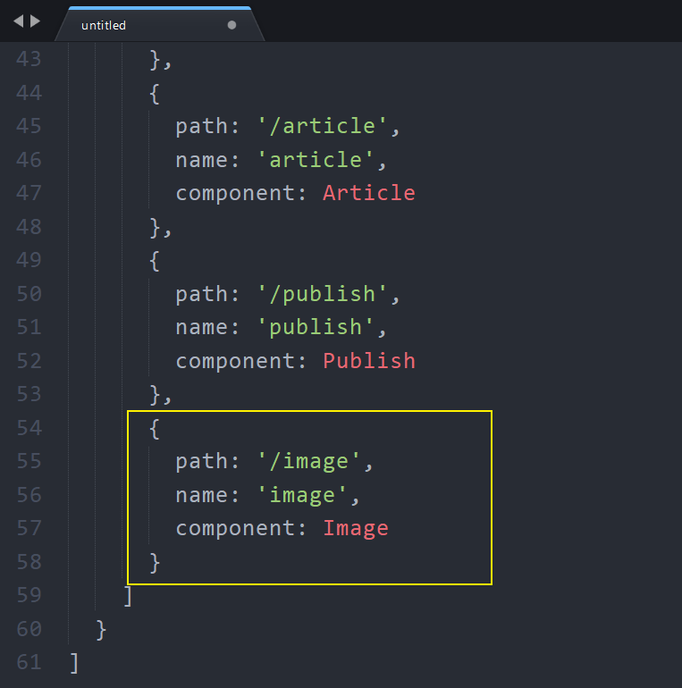
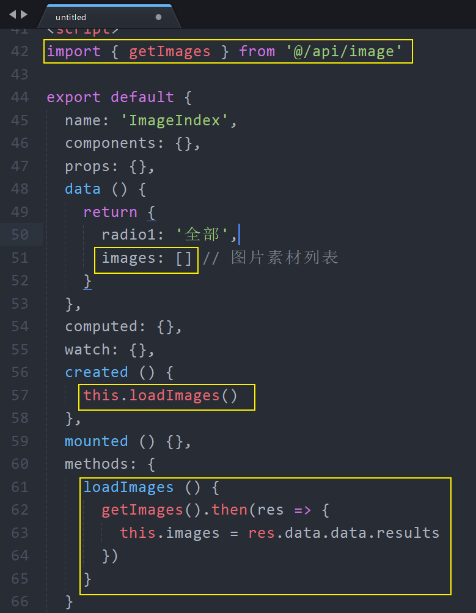
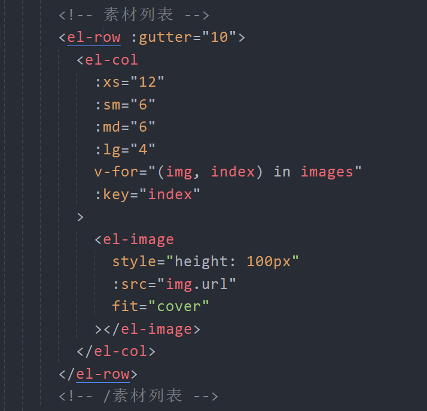
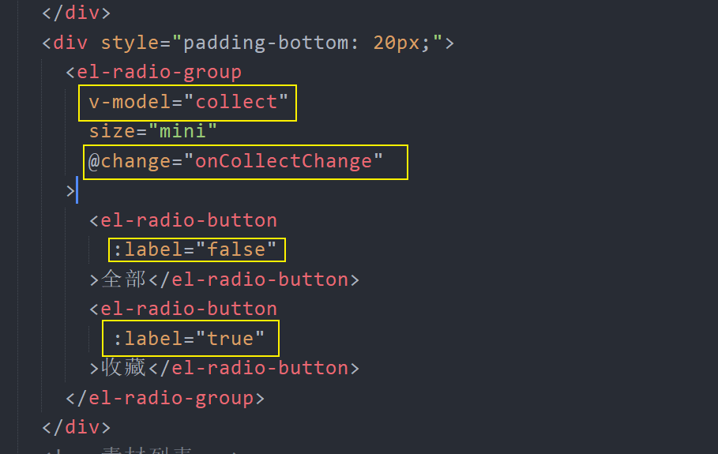
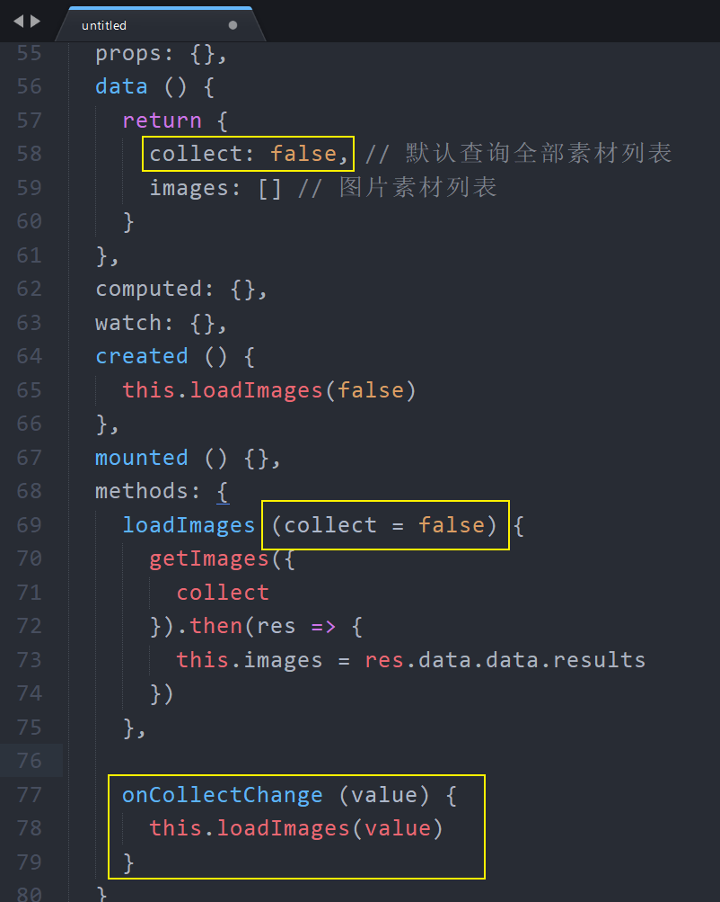
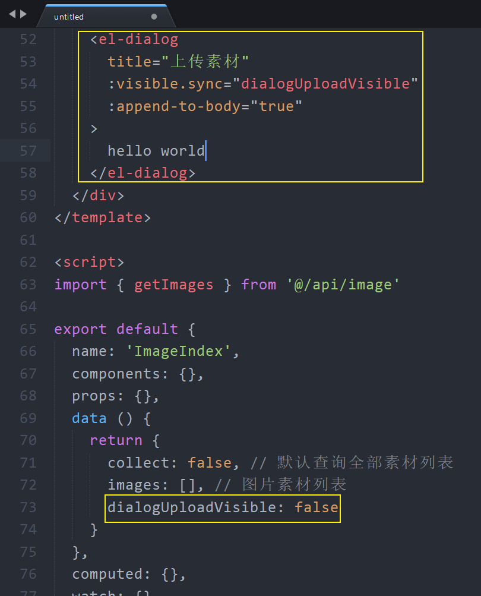
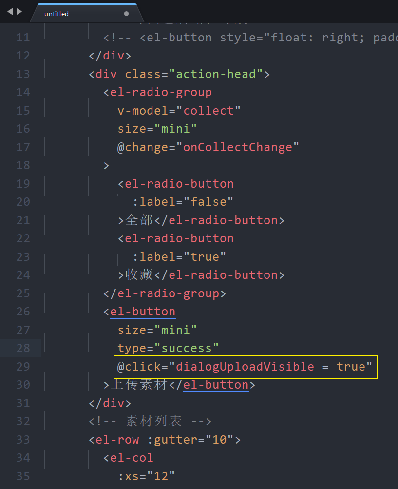
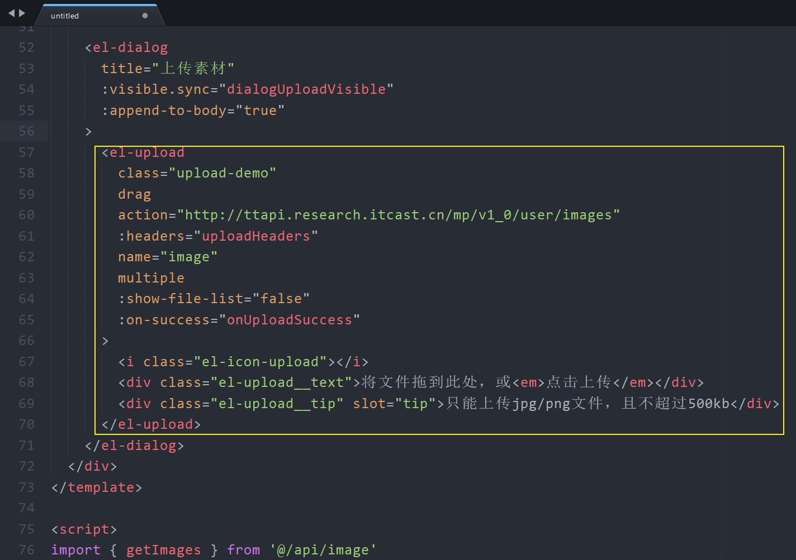

# 六、素材管理

## 创建组件并配置路由

1、创建 `src/views/image/index.vue`

```html
<template>
  <div class="image-container">素材管理</div>
</template>

<script>
export default {
  name: 'ImageIndex',
  components: {},
  props: {},
  data () {
    return {}
  },
  computed: {},
  watch: {},
  created () {},
  mounted () {},
  methods: {}
}
</script>

<style scoped lang="less"></style>

```

2、配置页面路由



## 页面布局

- [Layout 布局](https://element.eleme.cn/#/zh-CN/component/layout)
- [Image 图片](https://element.eleme.cn/#/zh-CN/component/image)

```html
<template>
  <div class="image-container">
    <el-card class="box-card">
      <div slot="header" class="clearfix">
        <!-- 面包屑路径导航 -->
        <el-breadcrumb separator-class="el-icon-arrow-right">
          <el-breadcrumb-item to="/">首页</el-breadcrumb-item>
          <el-breadcrumb-item>素材管理</el-breadcrumb-item>
        </el-breadcrumb>
        <!-- /面包屑路径导航 -->
        <!-- <el-button style="float: right; padding: 3px 0" type="text">操作按钮</el-button> -->
      </div>
      <div style="padding-bottom: 20px;">
        <el-radio-group v-model="radio1" size="mini">
          <el-radio-button label="全部"></el-radio-button>
          <el-radio-button label="收藏"></el-radio-button>
        </el-radio-group>
      </div>
      <!-- 素材列表 -->
      <el-row :gutter="10">
        <el-col :xs="12" :sm="6" :md="6" :lg="4">
          <el-image
            style="height: 100px"
            src="https://fuss10.elemecdn.com/e/5d/4a731a90594a4af544c0c25941171jpeg.jpeg"
            fit="cover"
          ></el-image>
        </el-col>
        <el-col :xs="12" :sm="6" :md="6" :lg="4">
          <el-image
            style="height: 100px"
            src="https://fuss10.elemecdn.com/e/5d/4a731a90594a4af544c0c25941171jpeg.jpeg"
            fit="cover"
          ></el-image>
        </el-col>
        <el-col :xs="12" :sm="6" :md="6" :lg="4">
          <el-image
            style="height: 100px"
            src="https://fuss10.elemecdn.com/e/5d/4a731a90594a4af544c0c25941171jpeg.jpeg"
            fit="cover"
          ></el-image>
        </el-col>
        <el-col :xs="12" :sm="6" :md="6" :lg="4">
          <el-image
            style="height: 100px"
            src="https://fuss10.elemecdn.com/e/5d/4a731a90594a4af544c0c25941171jpeg.jpeg"
            fit="cover"
          ></el-image>
        </el-col>
        <el-col :xs="12" :sm="6" :md="6" :lg="4">
          <el-image
            style="height: 100px"
            src="https://fuss10.elemecdn.com/e/5d/4a731a90594a4af544c0c25941171jpeg.jpeg"
            fit="cover"
          ></el-image>
        </el-col>
        <el-col :xs="12" :sm="6" :md="6" :lg="4">
          <el-image
            style="height: 100px"
            src="https://fuss10.elemecdn.com/e/5d/4a731a90594a4af544c0c25941171jpeg.jpeg"
            fit="cover"
          ></el-image>
        </el-col>
        <el-col :xs="12" :sm="6" :md="6" :lg="4">
          <el-image
            style="height: 100px"
            src="https://fuss10.elemecdn.com/e/5d/4a731a90594a4af544c0c25941171jpeg.jpeg"
            fit="cover"
          ></el-image>
        </el-col>
        <el-col :xs="12" :sm="6" :md="6" :lg="4">
          <el-image
            style="height: 100px"
            src="https://fuss10.elemecdn.com/e/5d/4a731a90594a4af544c0c25941171jpeg.jpeg"
            fit="cover"
          ></el-image>
        </el-col>
      </el-row>
      <!-- /素材列表 -->
    </el-card>
  </div>
</template>

<script>
export default {
  name: 'ImageIndex',
  components: {},
  props: {},
  data () {
    return {
      radio1: '全部'
    }
  },
  computed: {},
  watch: {},
  created () {},
  mounted () {},
  methods: {}
}
</script>

<style scoped lang="less"></style>

```


## 展示素材列表

1、封装获取素材列表数据请求方法

```js
/**
 * 获取素材列表
 */
export const getImages = params => {
  return request({
    method: 'GET',
    url: '/mp/v1_0/user/images',
    params
  })
}
```

2、在素材管理页面组件中加载获取数据



3、模板绑定



## 数据筛选






## 上传素材

### 处理对话框

1、添加对话框组件



2、点击按钮显示对话框



### 使用 upload 上传组件

1、配置使用 upload 上传组件



2、上传成功处理


## 数据分页

## 收藏/取消收藏图片

## 删除图片


