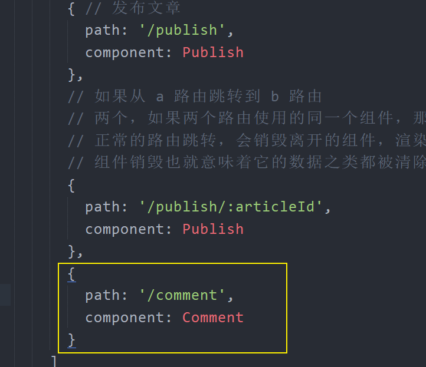
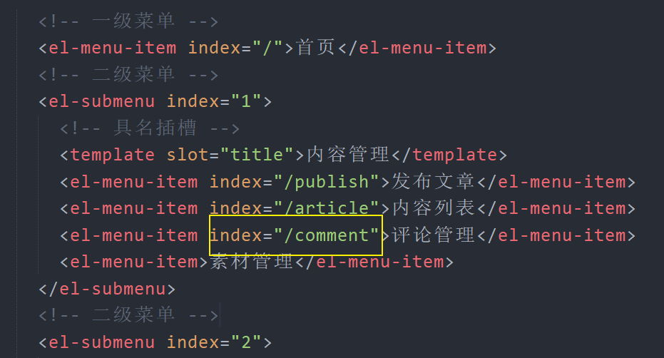
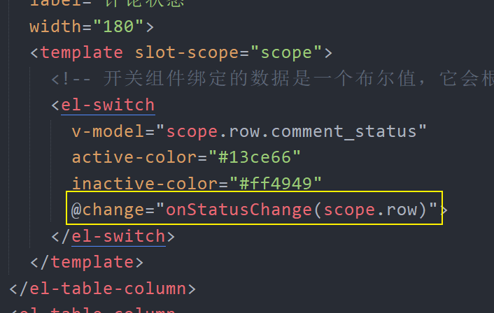
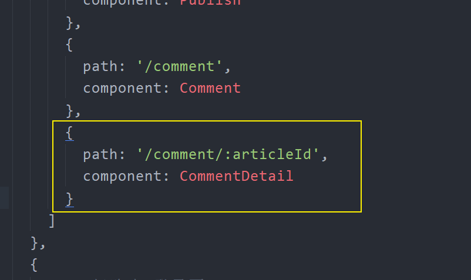
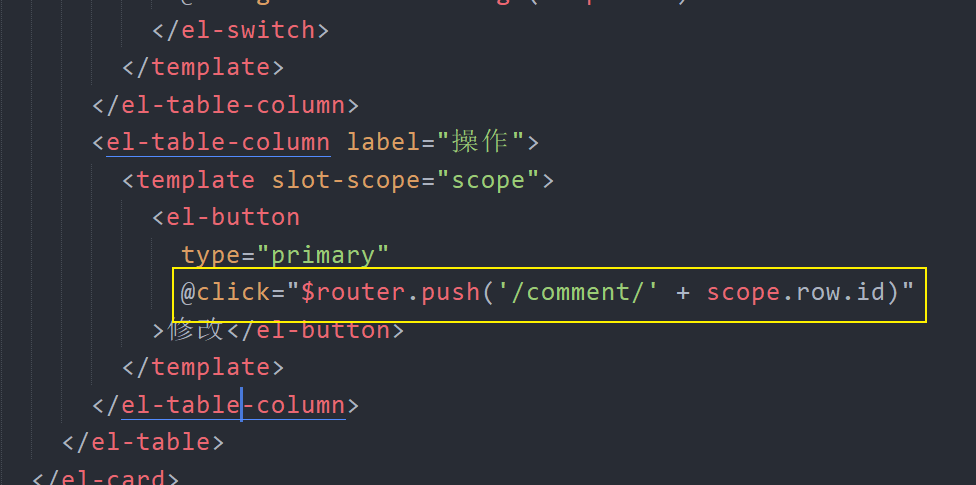
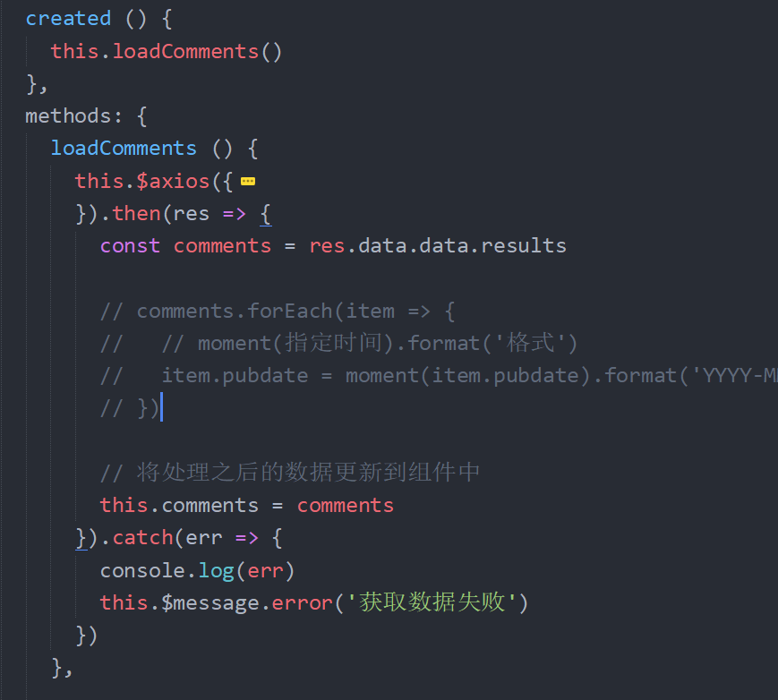
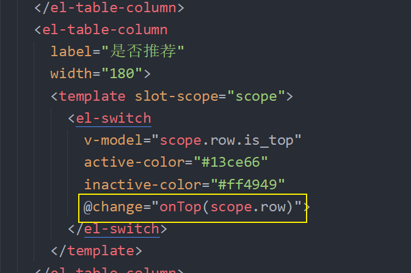

# 七、评论模块

## 评论列表

### 创建组件并配置路由

1、创建 `src/views/comment/index.vue` 并写入

```html
<template>
  <div>
    评论管理
  </div>
</template>

<script>
  export default {
    // 组件的 name 最好起名为两个单词，尽量少用一个单词
    // 为什么？为了避免和原生的 html 标签冲突
    name: "CommentIndex",
    components: {},
    props: {},
    data() {
      return {};
    },
    computed: {},
    watch: {},
    created() {},
    methods: {}
  };
</script>

<style scoped></style>
```

2、配置路由表



3、配置侧边栏的导航路径



最后在浏览器中访问测试。

### 布局

```html
<template>
  <div>
    <el-card class="box-card">
      <div slot="header" class="clearfix">
        <span>评论管理</span>
      </div>
      <el-table :data="tableData" style="width: 100%">
        <el-table-column prop="date" label="日期" width="180">
        </el-table-column>
        <el-table-column prop="name" label="姓名" width="180">
        </el-table-column>
        <el-table-column prop="address" label="地址"> </el-table-column>
      </el-table>
    </el-card>
  </div>
</template>

<script>
  export default {
    // 组件的 name 最好起名为两个单词，尽量少用一个单词
    // 为什么？为了避免和原生的 html 标签冲突
    name: "CommentIndex",
    components: {},
    props: {},
    data() {
      return {
        tableData: [
          {
            date: "2016-05-02",
            name: "王小虎",
            address: "上海市普陀区金沙江路 1518 弄"
          },
          {
            date: "2016-05-04",
            name: "王小虎",
            address: "上海市普陀区金沙江路 1517 弄"
          },
          {
            date: "2016-05-01",
            name: "王小虎",
            address: "上海市普陀区金沙江路 1519 弄"
          },
          {
            date: "2016-05-03",
            name: "王小虎",
            address: "上海市普陀区金沙江路 1516 弄"
          }
        ]
      };
    },
    computed: {},
    watch: {},
    created() {},
    methods: {}
  };
</script>

<style scoped></style>
```

### 展示文章评论列表

```html
<template>
  <div>
    <el-card class="box-card">
      <div slot="header" class="clearfix">
        <span>评论管理</span>
      </div>
      <el-table :data="articles" style="width: 100%">
        <el-table-column prop="title" label="标题" width="180">
        </el-table-column>
        <el-table-column prop="total_comment_count" label="总评论数">
        </el-table-column>
        <el-table-column prop="fans_comment_count" label="粉丝评论数据">
        </el-table-column>
        <el-table-column label="评论状态" width="180">
          <template slot-scope="scope">
            <!-- 开关组件绑定的数据是一个布尔值，它会根据布尔值的真假来决定开关状态 -->
            <el-switch
              v-model="scope.row.comment_status"
              active-color="#13ce66"
              inactive-color="#ff4949"
            >
            </el-switch>
          </template>
        </el-table-column>
        <el-table-column label="操作">
          <template>
            <el-button type="primary">修改</el-button>
          </template>
        </el-table-column>
      </el-table>
    </el-card>
  </div>
</template>

<script>
  export default {
    // 组件的 name 最好起名为两个单词，尽量少用一个单词
    // 为什么？为了避免和原生的 html 标签冲突
    name: 'CommentIndex',
    components: {},
    props: {},
    data () {
      return {
  +      articles: [] // 文章列表（文章的评论数据字段）
      }
    },
    computed: {},
    watch: {
    },
    created () {
  +    this.loadArticles()
    },
    methods: {
  +++    loadArticles () {
        this.$axios({
          method: 'GET',
          url: '/articles',
          params: {
            response_type: 'comment'
            // page: xxx // 页码
          }
        }).then(res => {
          this.articles = res.data.data.results
        }).catch(err => {
          console.log(err, '获取数据失败')
        })
      }
    }
  }
</script>

<style scoped></style>
```

### 修改评论状态

1、给开关组件注册 `change` 事件



2、在事件处理函数请求修改评论状态

```js
onStatusChange (article) {
  this.$axios({
    method: 'PUT',
    url: '/comments/status',
    params: {
      article_id: article.id.toString()
    },
    data: {
      // 开关组件双向绑定了 article.comment_status
      // 所以获取 article.comment_status 也就是在获取开关组件的启用状态
      allow_comment: article.comment_status
    }
  }).then(res => {
    console.log(res)
    this.$message({
      type: 'success',
      message: `${article.comment_status ? '启用' : '关闭'}成功`
    })
  }).catch(err => {
    console.log(err)
    this.$message.error('操作失败')
  })
}
```

### 数据分页

## 评论管理

> 测试文章：1196354762019176448

### 创建组件并配置路由

1、创建 `src/views/comment-detail/index.vue` 并写入

```html
<template>
  <div>评论列表</div>
</template>

<script>
  export default {
    name: "CommentDetail",
    components: {},
    props: {},
    data() {
      return {};
    },
    computed: {},
    watch: {},
    created() {},
    methods: {}
  };
</script>

<style scoped></style>
```

2、配置路由



3、在评论列表中点击修改跳转到评论详情页



### 布局

### 展示评论列表

1、在 data 中添加 `comments` 用于存储评论列表

```js
data () {
  return {
    ...
    comments: []
  }
}
```

2、在生命周期 `created` 中请求获取评论数据



3、模板绑定

```html
<template>
  <div>
    <el-card class="box-card">
      <div slot="header" class="clearfix">
        <span>评论详情列表</span>
        <el-button style="float: right; padding: 3px 0" type="text"
          >操作按钮</el-button
        >
      </div>

      <el-table :data="comments" style="width: 100%">
        <el-table-column label="头像" width="180">
          <template slot-scope="scope">
            
          </template>
        </el-table-column>
        <el-table-column prop="content" label="评论内容" width="180">
        </el-table-column>
        <el-table-column prop="name" label="点赞" width="180">
          <template slot-scope="scope">
            {{ scope.row.is_liking === 1 ? '已赞' : '没有赞' }}
          </template>
        </el-table-column>
        <el-table-column prop="like_count" label="点赞数量" width="180">
        </el-table-column>
        <el-table-column prop="pubdate" label="评论日期" width="180">
          <template slot-scope="scope">
            <!--
              不传参：{{ scope.row.pubdate | dateFormat }}
              传参：{{ scope.row.pubdate | dateFormat(参数) }}
             -->
            {{ scope.row.pubdate | dateFormat('YYYY-MM-DD') }}
          </template>
        </el-table-column>
        <el-table-column label="是否推荐" width="180">
          <template slot-scope="scope">
            <el-switch
              v-model="scope.row.is_top"
              active-color="#13ce66"
              inactive-color="#ff4949"
              @change="onTop(scope.row)"
            >
            </el-switch>
          </template>
        </el-table-column>
        <el-table-column prop="reply_count" label="回复数量" width="180">
        </el-table-column>
      </el-table>
    </el-card>
  </div>
</template>
```

### 评论推荐

1、给推荐按钮注册点击事件



2、在处理函数中

```js
onTop (comment) {
  this.$axios({
    method: 'PUT',
    url: `/comments/${comment.com_id}/sticky`,
    data: {
      // comment.is_top 双向绑定给了开关按钮
      // 所以获取 comment.is_top 就是在获取开关的状态
      sticky: comment.is_top
    }
  }).then(res => {
    this.$message('操作成功')
  }).catch(err => {
    this.$message.error('操作失败', err)
  })
}
```
