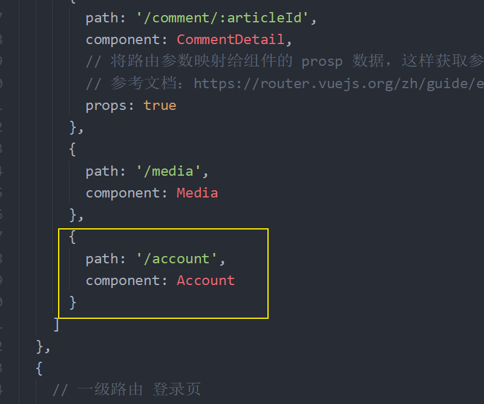
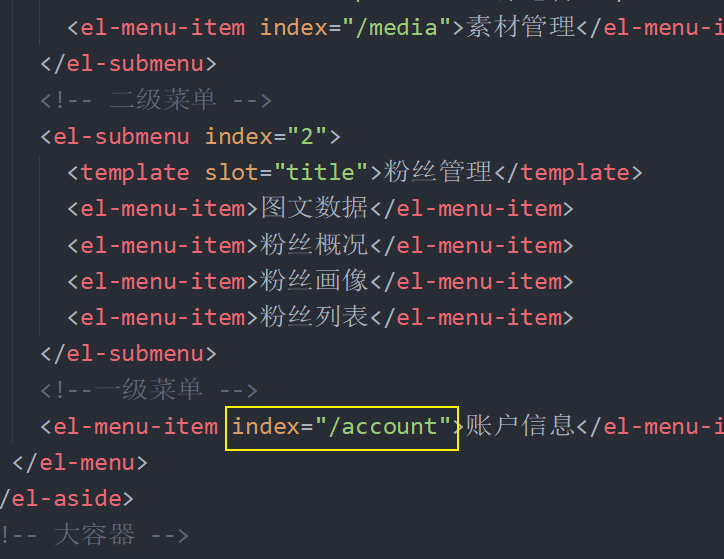
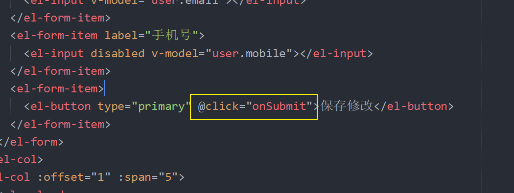
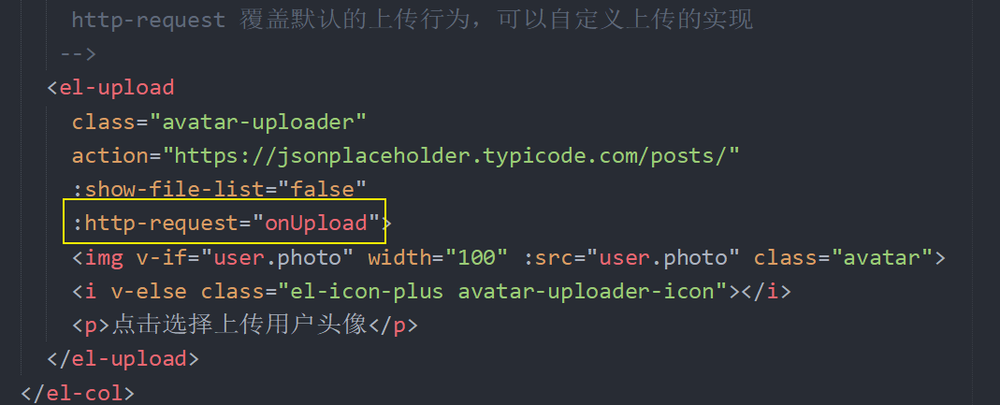
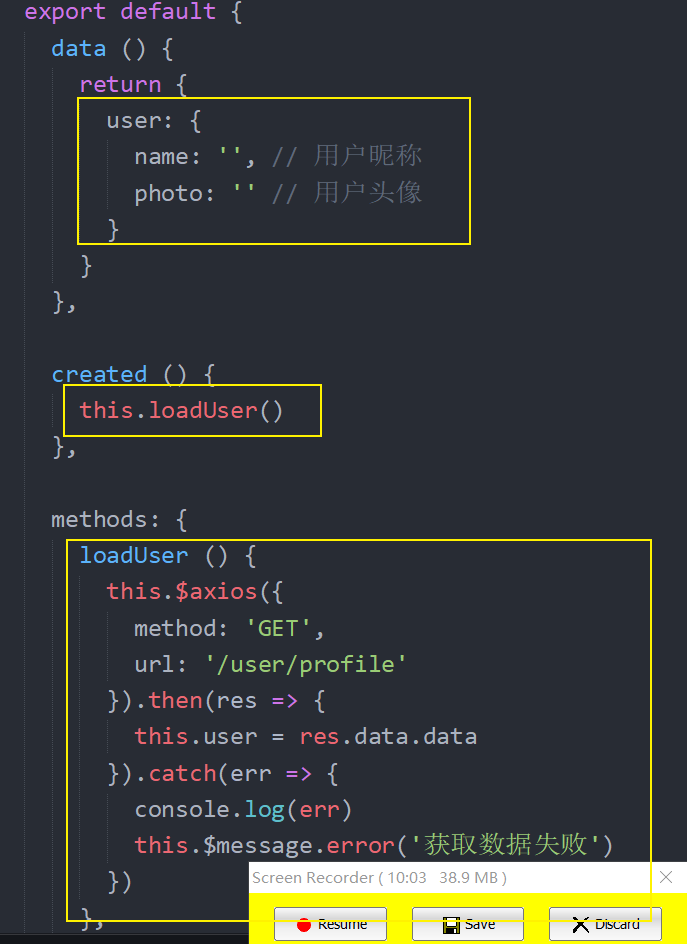
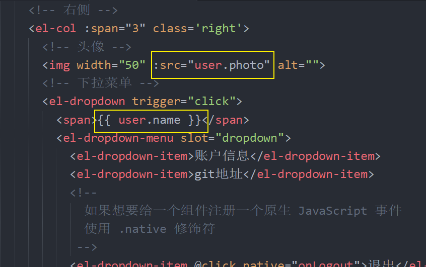
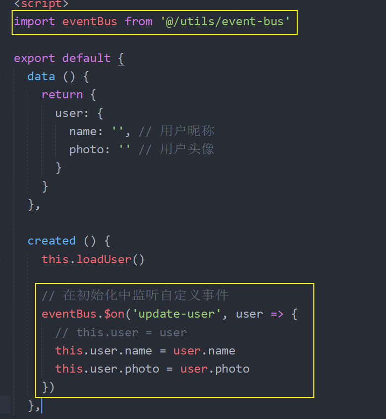
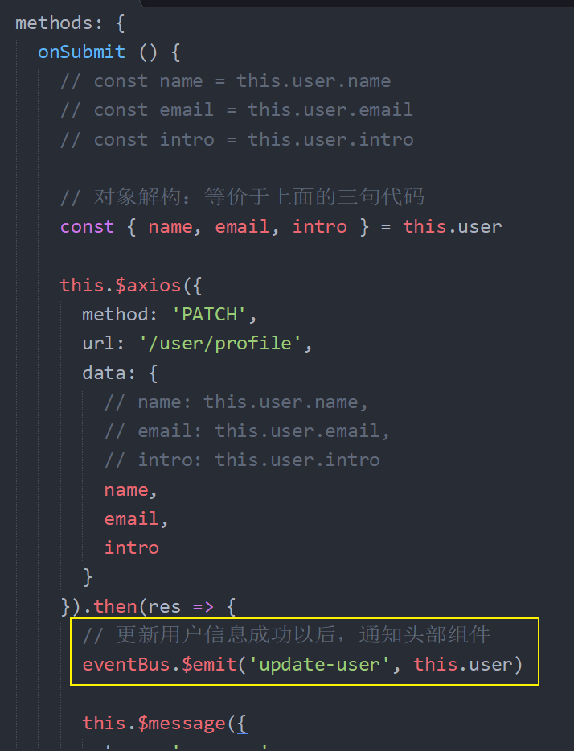
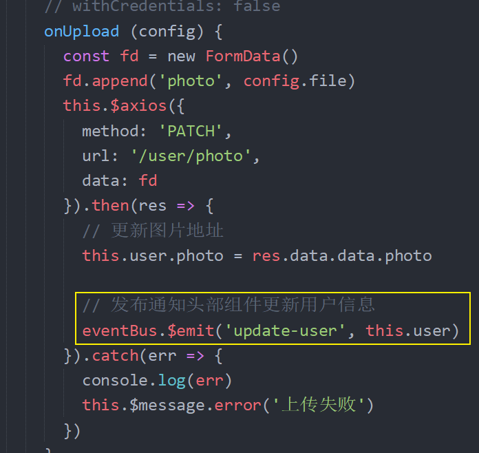

# 八、账户设置

## 创建页面组件并配置路由

1、创建 `src/views/account/index.vue` 组件

```html
<template>
  <div>
    <el-form ref="form" :model="form" label-width="80px">
      <el-form-item label="用户头像">
        <el-upload
          class="avatar-uploader"
          action="https://jsonplaceholder.typicode.com/posts/"
          :show-file-list="false"
        >
          
          <!-- <i class="el-icon-plus avatar-uploader-icon"></i> -->
        </el-upload>
      </el-form-item>
      <el-form-item label="用户昵称">
        <el-input v-model="form.name"></el-input>
      </el-form-item>
      <el-form-item label="个人介绍">
        <el-input type="textarea" v-model="form.name"></el-input>
      </el-form-item>
      <el-form-item label="用户邮箱">
        <el-input v-model="form.name"></el-input>
      </el-form-item>
      <el-form-item>
        <el-button type="primary" @click="onSubmit">保存修改</el-button>
      </el-form-item>
    </el-form>
  </div>
</template>

<script>
  export default {
    name: "AccountIndex",
    components: {},
    props: {},
    data() {
      return {
        form: {
          name: "",
          region: "",
          date1: "",
          date2: "",
          delivery: false,
          type: [],
          resource: "",
          desc: ""
        }
      };
    },
    computed: {},
    watch: {},
    created() {},
    methods: {
      onSubmit() {
        console.log("保存");
      }
    }
  };
</script>

<style scoped></style>
```

2、配置路由



3、配置侧边栏导航链接



## 展示账户信息

```html
<template>
  <div>
    <el-form ref="form" :model="user" label-width="80px">
      <el-form-item label="用户头像">
        <el-upload
          class="avatar-uploader"
          action="https://jsonplaceholder.typicode.com/posts/"
          :show-file-list="false"
        >
          
          <!-- <i class="el-icon-plus avatar-uploader-icon"></i> -->
        </el-upload>
      </el-form-item>
      <el-form-item label="用户昵称">
        <el-input v-model="user.name"></el-input>
      </el-form-item>
      <el-form-item label="个人介绍">
        <el-input type="textarea" v-model="user.intro"></el-input>
      </el-form-item>
      <el-form-item label="用户邮箱">
        <el-input v-model="user.email"></el-input>
      </el-form-item>
      <el-form-item label="手机号">
        <el-input v-model="user.mobile"></el-input>
      </el-form-item>
      <el-form-item>
        <el-button type="primary" @click="onSubmit">保存修改</el-button>
      </el-form-item>
    </el-form>
  </div>
</template>

<script>
  export default {
    name: 'AccountIndex',
    components: {},
    props: {},
    data () {
      return {
  +++      user: {
          email: '', // 邮箱
          intro: '', // 简介
          mobile: '', // 手机号
          name: '', // 昵称
          photo: '' // 头像
        }
      }
    },
    computed: {},
    watch: {
    },
    created () {
  +    this.loadUserProfile()
    },
    methods: {
      onSubmit () {
        console.log('保存')
      },

  +++    loadUserProfile () {
        this.$axios({
          method: 'GET',
          url: '/user/profile'
        }).then(res => {
          // res.date undefined
          // undefined.data 报错了
          this.user = res.data.data
        }).catch(err => {
          console.log(err)
          this.$message.error('获取数据失败')
        })
      }
    }
  }
</script>

<style scoped></style>
```

## 修改账户信息

1、注册表单提交



2、在事件处理函数中

```js
onSubmit () {
  // const name = this.user.name
  // const email = this.user.email
  // const intro = this.user.intro

  // 对象解构：等价于上面的三句代码
  const { name, email, intro } = this.user

  this.$axios({
    method: 'PATCH',
    url: '/user/profile',
    data: {
      // name: this.user.name,
      // email: this.user.email,
      // intro: this.user.intro
      name,
      email,
      intro
    }
  }).then(res => {
    this.$message({
      type: 'success',
      message: '修改成功'
    })
  }).catch(err => {
    console.log(err)
    this.$message.error('修改失败')
  })
},
```

## 用户头像上传

由于 element 的 upload 组件不支持自定义请求方法（默认是 POST，我们的接口要的是 PATCH），所以我们需要自定义上传组件的请求行为：



然后在 `onUpload` 函数中

```js
onUpload (config) {
  const fd = new FormData()
  fd.append('photo', config.file)
  this.$axios({
    method: 'PATCH',
    url: '/user/photo',
    data: fd
  }).then(res => {
    // 更新图片地址
    this.user.photo = res.data.data.photo
  }).catch(err => {
    console.log(err)
    this.$message.error('上传失败')
  })
}
```

## 头像裁切上传

```
viewMode: 1,
dragMode: 'move',
aspectRatio: 1,
cropBoxMovable: false,
cropBoxResizable: false,
background: false,
movable: true
```


## 展示当前登录用户信息

1、请求获取数据



2、数据绑定



## 将修改同步到头部

如何让非父子组件通信？Events Bus。

一、基本语法规则

1、创建 `src/utils/event-bus.js` 并写入

```js
import Vue from "vue";

// 直接导出一个空的 Vue 实例
export default new Vue();
```

2、使用 `event-bus` 通信

在通信的 a 端初始化 `created` 的时候注册监听一个自定义事件：

```js
import eventBus from '@/utils/event-bus'

export default {
  ...
  created () {
  	// 参数1：一个字符串，自定义事件名称
  	// 参数2：一个函数，事件发布以后就会调用
  	eventBus.$on('自定义事件名称', () => {
      // 业务逻辑代码
    })

    // 如果有参数的话，就声明接收
    eventBus.$on('自定义事件名称', (arg) => {
      // 业务逻辑代码
    })
	}
}
```

在通信的 b 端发布调用自定义事件

```js
import eventBus from '@/utils/event-bus'

export default {
  ...
  methods: {
    // 在某个业务方法中
    test () {
      // 参数1：自定义事件名称，必须是订阅的名字一致
      eventBus.$emit('自定义事件名称')

      // 如果需要传递额外的数据参数，就从第2个参数开始传
      eventBus.$emit('自定义事件名称', 123)
    }
  }
}
```

注意，通信的双向的：

- a 给 b 发：b 来订阅，a 来发布
- b 给 a 发：a 来订阅，b 来发布

另外，同类型的事件可以订阅多次：

```js
eventBus.$on("abc", () => {
  console.log("abc1");
});

eventBus.$on("abc", () => {
  console.log("abc2");
});

eventBus.$on("ddd", () => {
  console.log("ddd");
});

eventBus.$emit("abc"); // abc1、abc2

eventBus.$emit("ddd"); // ddd

eventBus.$emit("hello"); // 不会报错，无人响应
```

二：使用 `event-bus` 处理我们的业务

1、在头部组件中使用 event-bus 订阅一个自定义事件，更新用户信息



2、在账户信息组件中，修改成功以后发布通知头部更新数据



> 更新基本信息，发布通知更新



> 更新头像成功，发布通知头部
