# 十、打包发布

## 构建打包

在发布上线之前，我们需要执行构建打包，将 `.less`、`.vue`、`.js` 等相关资源进行编译打包，转换成浏览器可以直接识别运行的普通 `css`、`js`、`html`。

```bash
# yarn run build 或者 yarn build
npm run build
```

VueCLI 会把打包结果生成存储到项目的 `dist` 目录中。

正确的话应该会得到这样一个打包结果：

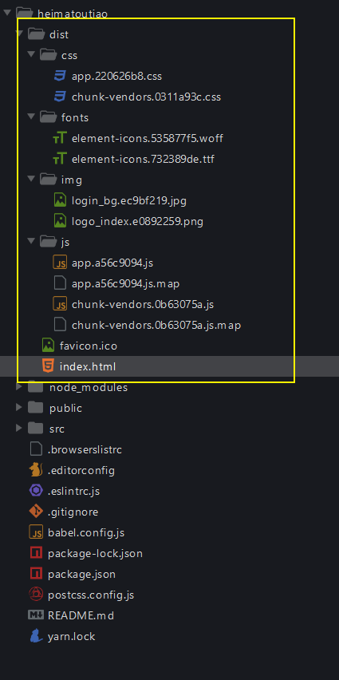

## 关于代码中的 console

console.log 只是用于开发测试使用，发布上线的话没有意义，所以 VueCLI 在打包构建的就是就给你报错不打包了。

正确的做法：

```
移除项目中所有的 console
```

为了给大家快速演示打包，我先手动把 console 校验关闭。

## 本地预览测试打包结果

> 注意：不能直接双击打开 index.html 运行。

将 dist 放到一个 Web 服务器中运行测试，常见的 Web 服务器：

- Ngxin
- Apache
- tomcat
- IIS
- 。。。。
- Node.js

前端安装配置上面的服务器软件麻烦，这里推荐使用 Vue 官方推荐的一个命令行 http 服务工具：[serve](https://github.com/zeit/serve)。

`dist` 目录需要启动一个 HTTP 服务器来访问 (除非你已经将 `publicPath` 配置为了一个相对的值)，所以以 `file://` 协议直接打开 `dist/index.html` 是不会工作的。在本地预览生产环境构建最简单的方式就是使用一个 Node.js 静态文件服务器，例如 [serve](https://github.com/zeit/serve)：

安装：

```bash
# yarn global add serve
# 注意：这是在安装全局包，在任何目录执行都可以
# 安装一次就可以了，以后不需要重复安装，顶多升级重装
npm install -g serve
```

然后在你的项目目录下执行：

```bash
# dist 是运行 Web 服务根目录
serve -s dist
```

如果启动成功，你将看到如下提示：

```
   ┌────────────────────────────────────────────────────┐
   │                                                    │
   │   Serving!                                         │
   │                                                    │
   │   - Local:            http://localhost:5000        │
   │   - On Your Network:  http://192.168.156.90:5000   │
   │                                                    │
   │   Copied local address to clipboard!               │
   │                                                    │
   └────────────────────────────────────────────────────┘
```

> serve 默认占用 5000 端口并启动一个服务

然后在浏览器中访问给出的地址访问测试。

你自己先大概的测试一下，确保打包结果可以正常运行，然后交由专业的测试人员进行测试。

如果测试出问题怎么办？

- 修改 src 源代码
- 重新构建打包

> 注意：
>
> 不要去修改 dist 中的文件代码，没有用。
>
> 因为每次 `npm run build` 都会先把原来的 dist 删除，然后生成新的结果。

## 部署

- 公司有专门的 devops，说白了就是运维
  - 有些公司没有专门的运维人员，那就后端负责
- 你只需要把打包结果给人家就可以了


如果想要自己部署，怎么办？

- 买一个服务器
  - 安装服务器运行环境
  - 阿里云、腾讯云、....
- 买个域名（非必须）
  - 第一次买非常便宜，几十块钱，续费非常贵
- 把项目代码推送到你的部署服务端
- 部署

```js
购买一个能24小时不关机的电脑（有了）
	安装配置服务器软件
  把你的项目打包结构扔到服务器的 Web 服务软件中
  阿里云（推荐）、腾讯云、百度云、
购买域名（非必须，也可以直接使用ip地址，只不过不好记）
```

## GitHub Pages

GitHub Pages 是 GitHub 提供的一种免费托管静态网站的服务功能。什么是静态网站？它只能处理纯粹的静态文件，例如 html、css、js、图片等资源，它不提供对 Java、PHP、Node.js、Python 等动态服务。

Vue 项目编译之后得到的不就是：纯粹的静态文件吗？

很多知名的技术网站都部署在 GitHub Pages 中：

- Vue.js 官方文档
- Angular 官方文档
- React 官方文档
- toutiao-publish.lipengzhou.com

所以仅适合纯静态资源：技术文档，个人博客...。

### 使用 GitHub Pages

### 关于默认域名

GitHub Pages 提供了免费域名：

- `用户名.github.io/仓库名/`
  - 可以有多个
- `用户名.github.io`
  - 只能有1个
  - 比较简洁，后面不用跟具体的仓库名称
  - 创建好以后它会直接帮你开启 GitHub Pages 功能

当然了，也可以自定义域名。

### 自定义域名

首先，你要有一个自己的域名。

- 阿里云万网
- 新网
- godaddy
- ...


1、登录你的域名管理后台，添加一个 CNAME 记录

```
lipengzhou.com

baidu.com
jd.com
taobao.com
	a.taobao.com
	b.taobao.com
	xxxx
	

```


2、在需要自定义域名的仓库中添加一个 `CNAME` 文件，里面写你自定义的那个域名。

## 扩展：GitHub Pages

GitHub 也提供了静态文件服务的功能，所谓的静态文件服务仅仅针对纯粹的 html、css、js 等文件托管。

它不能部署后端服务，例如 Java、Node.js、PHP 等都不行。

有了它，我们就能免费薅羊毛。我们能使用它部署自己的博客、学习测试的网站等都可以玩儿了 。

### 把静态文件推到 github 仓库

### 开启 GitHub Pages 服务

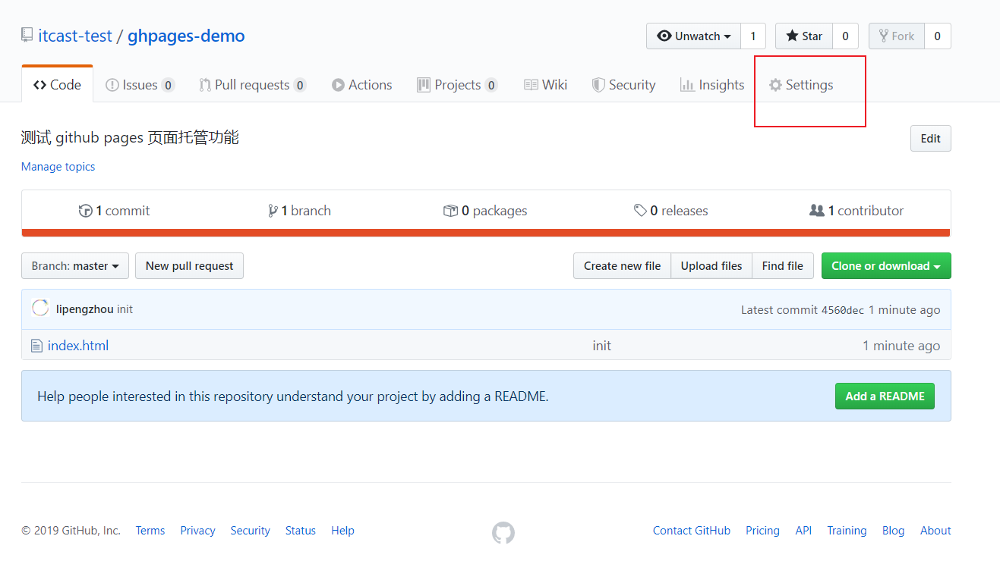

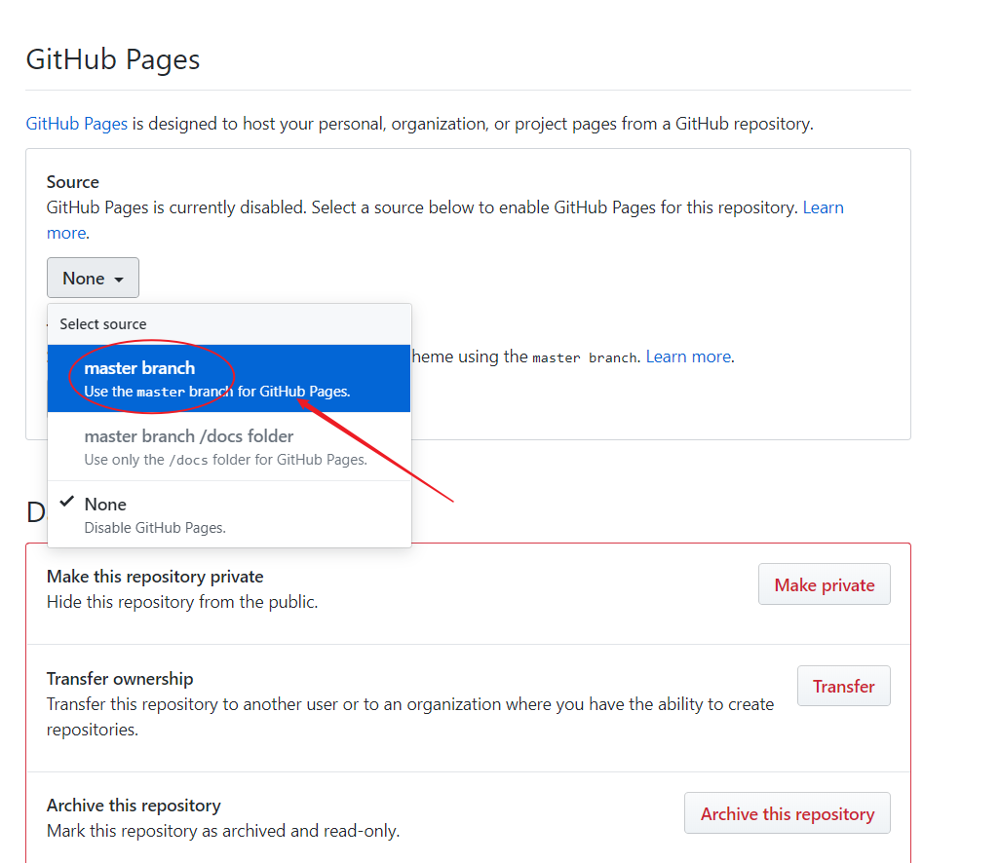

> 将 source 设置为你的 HTML 文件所在的分支

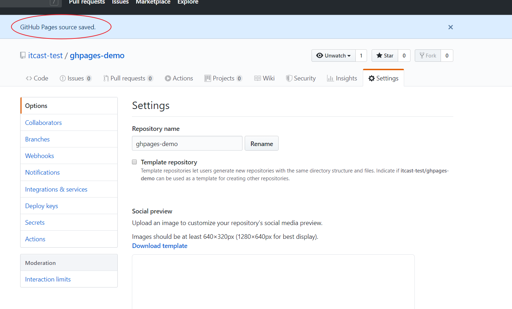

> 提示成功，往下滚动，找到给出的访问地址

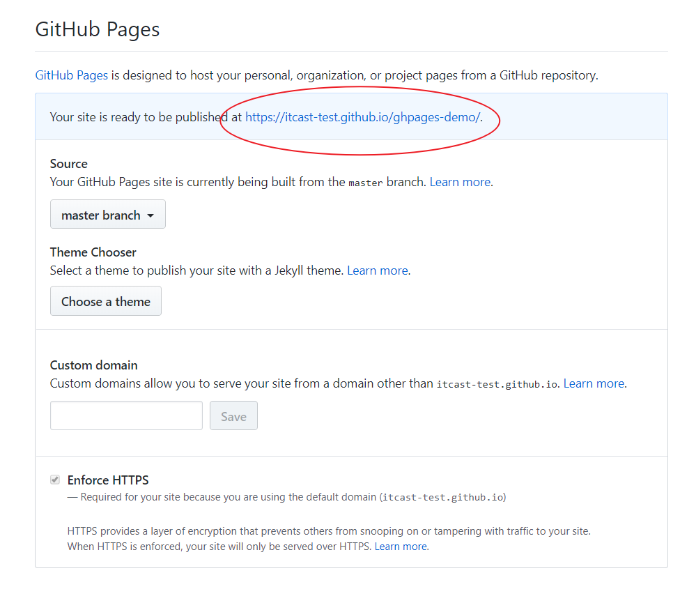

> 访问图示中给出的地址

### 关于域名

#### 默认域名

GitHub 支持两种域名方式：

- 一种是：`你的用户id.github.io`

  - 只能有一个

- 一种是：`你的用户id.github.io/xxx`
  - 可以有任意个

对于第一种，你必须创建一个名字叫 `你的用户id.github.io` 的仓库，那么该仓库启用 GitHub Pages 之后默认域名就是：`你的用户id.github.io`。

对于第二种，仓库名字就无所谓了，托管到 GitHub Pages 的域名都是 `你的用户id.github.io/仓库名称`。

#### 自定义域名

GitHub 同时也支持自定义域名，前提是你得有一个个域名，推荐从以下渠道购买：

- [阿里云 - 万网](https://wanwang.aliyun.com/)
- [GoDaddy](https://www.godaddy.com/)
- [新网](http://www.xinnet.com/)
- ...

接下来推荐阅读：[三步搞定 Github Pages 自定义域名](https://www.jianshu.com/p/2647e079741f)。

## 将我们的项目部署到 GitHub Pages

1、准备一个自己的域名

- GitHub 默认的免费域名强制开启 https
- 在 https 协议中无法发出 http 请求
- 我们项目中使用的接口都是 http 协议的，所以需要准备一个自己的域名，因为自定义域名可以选择使用 http 协议或者 https 协议
- 或者你让接口开发者为接口服务提供 https 的支持


2、在域名管理后台添加 `CNAME` 记录

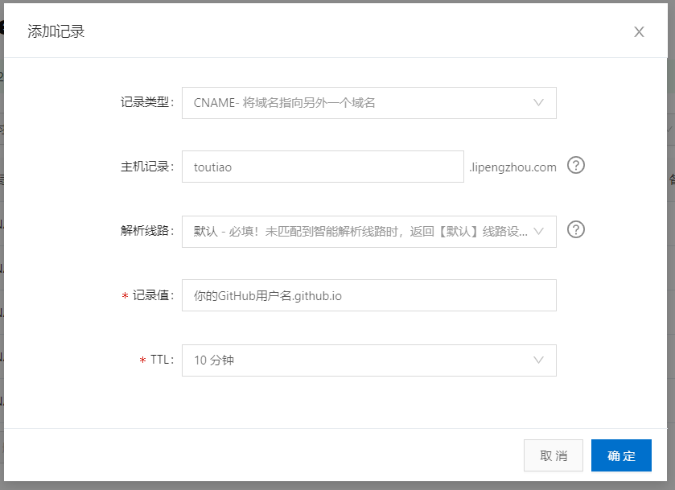


3、在项目的 `public` 目录中添加 `CNAME` 文件

```
toutiuao.lipengzhou.com
```


4、生成 GitHub 访问令牌

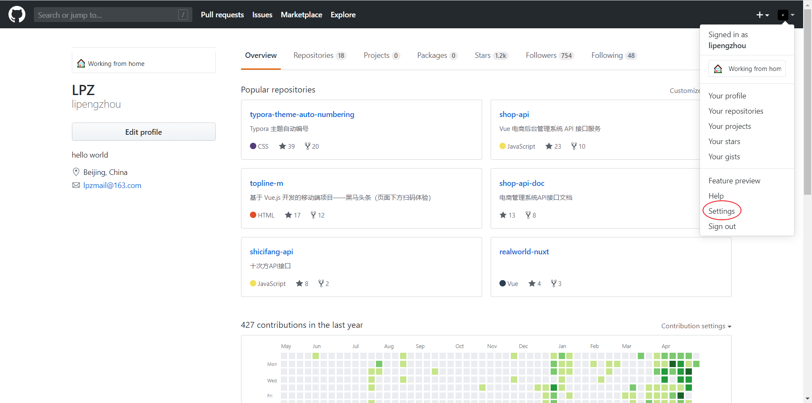

> 点击用户设置

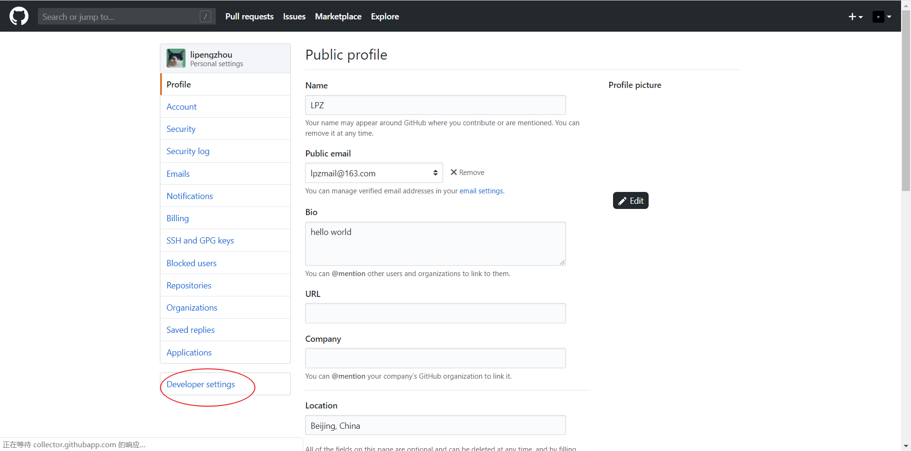

> 选择 Developer settings

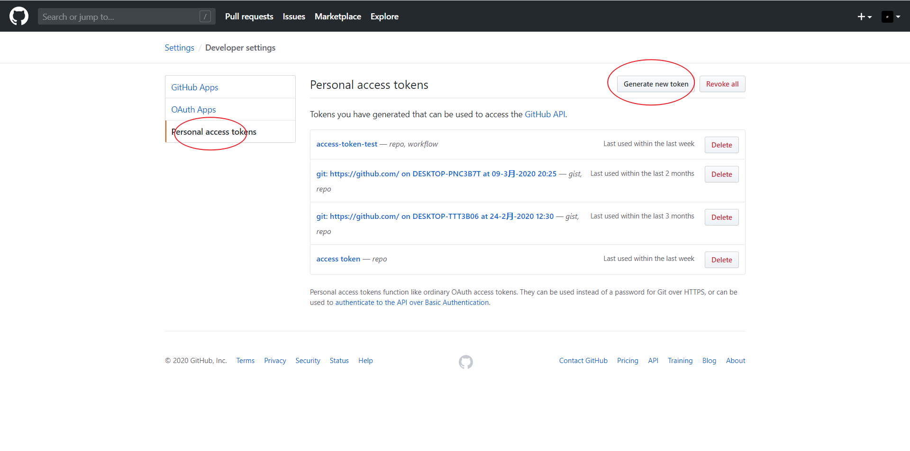

> 选择 Personal access tokens -> Generate new token

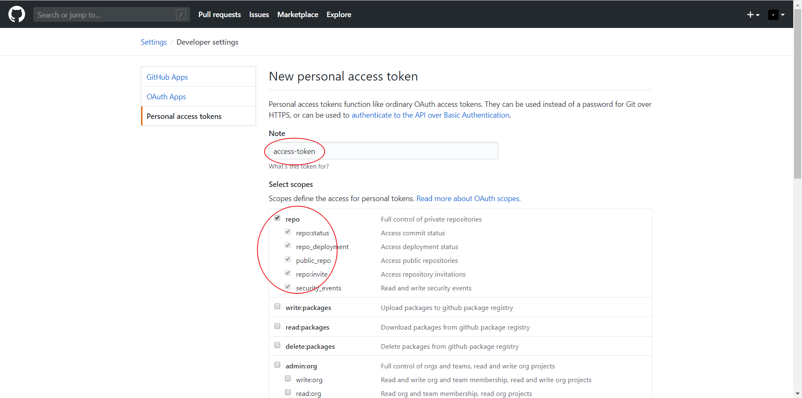

> Node: 

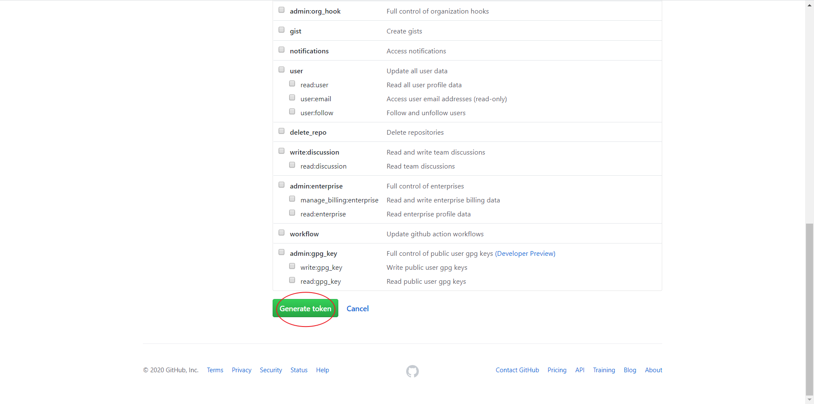

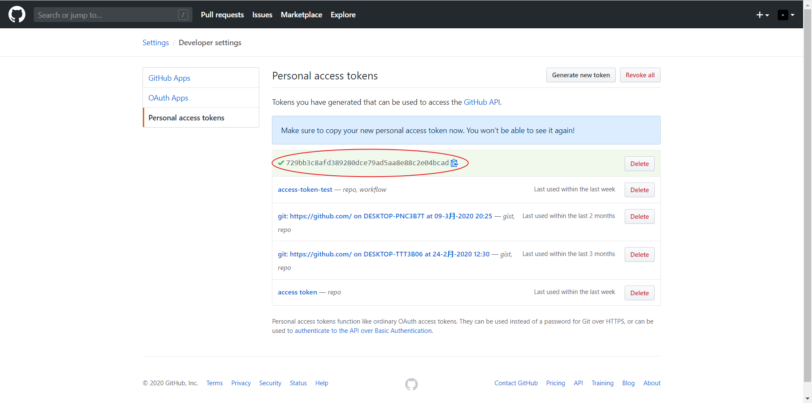

> token 仅显示1次，之后无法查看，所以建议把 token 保存到你的私密位置。


5、创建远程仓库（如果已经创建则不需要了）

6、将 GitHub 访问令牌添加到远程仓库的 secrets 中

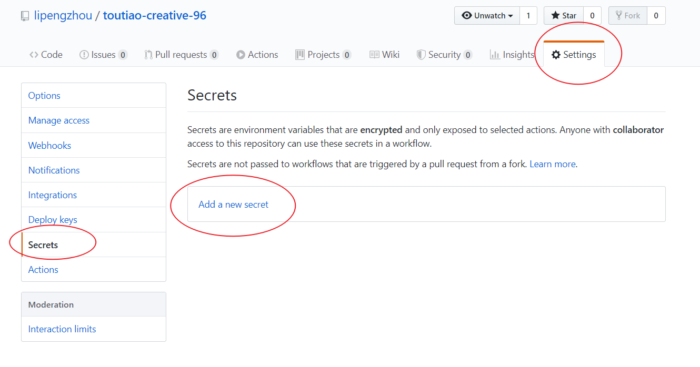

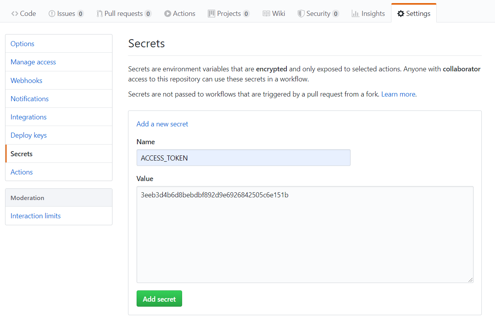

> Name：`ACCESS_TOKEN`
>
> Value: `之前生成的 GitHub 访问令牌`

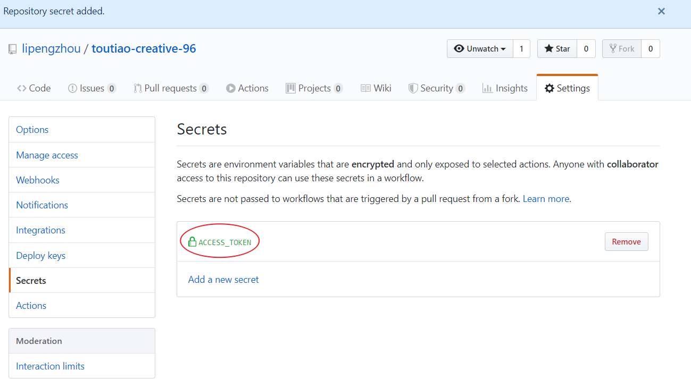

> 添加成功了


7、在项目根目录中添加 `.github/workflows/main.yml`

```yaml
name: build and deploy

# 当 master 分支 push 代码的时候触发 workflow
on:
  push:
    branches:
    - master

jobs:
  build-deploy:
    runs-on: ubuntu-latest
    steps:
    # 下载仓库代码
    - uses: actions/checkout@v2
    
    # 缓存依赖
    - name: Get yarn cache
      id: yarn-cache
      run: echo "::set-output name=dir::$(yarn cache dir)"
    - uses: actions/cache@v1
      with:
        path: ${{ steps.yarn-cache.outputs.dir }}
        key: ${{ runner.os }}-yarn-${{ hashFiles('**/yarn.lock') }}
        restore-keys: |
          ${{ runner.os }}-yarn-
    
    # 安装依赖
    - run: yarn
    
    # 打包构建
    - run: yarn build
    
    # 发布到 GitHub Pages
    - name: Deploy
      uses: peaceiris/actions-gh-pages@v2
      env:
        PERSONAL_TOKEN: ${{ secrets.ACCESS_TOKEN }} # 访问秘钥
        PUBLISH_BRANCH: gh-pages # 推送分支
        PUBLISH_DIR: ./dist # 部署目录
```

> 有兴趣的话可以了解一下：GitHub Action，不建议大家现在去折腾这个东西。


8、把项目代码推送到远程仓库

9、查看构建部署状态（它需要执行一个构建部署的流程，没那么快）


最后就是如何更新项目网站？

```
很简单，修改源代码，把更新提交到远程仓库即可。
说白了你可以忽略网站部署这件事儿了。
```

然后你可以通过仓库中的 Action 查看构建部署状态（非必须）。

不想看的话就等一会儿就可以了。


如果打算将项目部署到 `https://.github.io/` 上, `publicPath` 将默认被设为 `"/"`，你可以忽略这个参数。

如果打算将项目部署到 `https://.github.io//` 上 (即仓库地址为 `https://github.com//`)，可将 `publicPath` 设为 `"//"`。举个例子，如果仓库名字为“my-project”，那么 `vue.config.js` 的内容应如下所示：

```js
module.exports = {
  publicPath: process.env.NODE_ENV === "production" ? "/my-project/" : "/"
};
```

修改完配置文件只有，要重新构建，然后将新的打包结果推到仓库才能生效。

推送的时候，为了方便，建议直接加上 `--force` 参数，强制推送。

```bash
# --force 强制推送，简写 -f
git push -u origin master -f
```

## 搭建自己的个人网站

- WordPress
  - 基于 PHP 开发的一个开源的网站工具
  - 它不能部署到 GitHub Pages，因为它需要 PHP 允许环境
  - 如果你想玩儿这个东西，我建议买个服务器，然后搭建 WordPress
- Ghost
  - 基于 Node.js 构建的一个开源的网站程序

类似于 WordPress、Ghost 比较适合普通用户，它们都有管理后台，管理发布的内容。


还有一种网站工具：静态网站生成器，这类的工具可以把 Markdown 文件转换为 HTML 文件，而且还有漂亮的外壳。

- Hexo
- Vuepress
  - Vue 官方开发的一个制作静态网站的工具
  - Vue 的官方文档都是基于它做的
  - 也可以做博客，因为它有博客插件